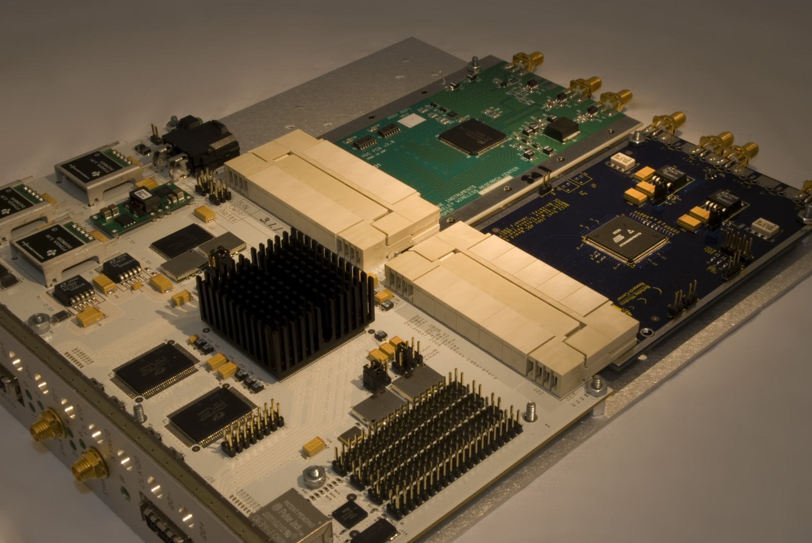

# IBOB

The IBOB (**I**nterconnect **B**reak-**o**ut **B**oard") is an
FPGA-based processing board for DSP. It features two Z-DOK connectors,
to which a variety of I/O boards can be attached (including dual
1GSa/sec ADC, quad 250MSa/sec ADC and DAC). The IBOB has a Xilinx
Virtex-II Pro 2VP50 FPGA, and is used in radio astronomy applications
primarily for digitizing data, performing downconversion, filtering and
FFT operations, and outputting this data over XAUI/10GbE, enabled by two
CX4 connectors on the board. It can be used to provide a high-speed
interface to BEE2 boards.

## History

The [BEE2](../BEE2/BEE2.md) platform provides a significant amount of
processing power with its 5 FPGAs. However, for its primary off-board
communication it relies on high-speed serial links via its CX4
connectors. The IBOB was designed as the way to take data from a
daughter board and pack it onto the InfiniBand or 10Gbit Ethernet
protocols for interface with BEE2s. Though originally intended to be
only a break-out board, it is very capable as a pre-processing board, or
as a standalone platform. It has been used to interface to ADC boards to
bring in digitized data for processing, output digital data to DAC
boards, as well as ASIC test setups as an integrated stimulus source and
data capture platform.

The successes of the IBOB platform have led to the development of a
next-generation board based on the Virtex-5 FPGA, the
[ROACH](../ROACH/ROACH.md) board.

## Description

IBOBs are outfitted with Xilinx Virtex-II Pro 2VP50 FPGAs. The 2VP50 has
53,136 logic cells, 232 18-kbit BlockRAMs, 232 18x18 multipliers, and 2
PowerPC processors.

The IBOB's primary interfaces are its 2 Tyco Z-DOK+ host adapters and
its 2 CX4 connectors. Each Z-DOK connector provides provides 40
differential pairs plus 4 voltages and ground, as well as a mechanically
robust mating for connecting daughter boards. The connector itself is
rated in excess of 6Gbps, though the FPGA I/O limits data rates to about
500Mbps, providing up to 20Gbps of I/O bandwidth per Z-DOK connector. On
the other side, the FPGA's MGT high-speed transceivers are wired to the
2 InfiniBand- and 10GbE-compatible CX4 connectors, each providing up to
10Gbps full-duplex bandwidth.

## Specifications

- **FPGA**
  - 1x [Xilinx Virtex-II Pro XC2VP50-7FF1152](http://www.xilinx.com/support/documentation/data_sheets/ds083.pdf) FPGA

- **Interfaces**
  - 2x [Tyco Z-DOK+](http://zdok.tycoelectronics.com) 40 differential pair connectors
  - 1x MDR 40 differential pair connector
  - 2x CX4 10Gbps high-speed serial connectors
  - 1x 10/100 RJ45 Ethernet interface (Rev 1 and later)
  - 1x RS232 interface
  - 80x GPIO headers with selectable IO voltage
  - 2x SMA IO

- **Peripherals**
  - 2x 512k x 36-bit SRAMs

- **Block Diagram**
  - [v1.1+ Block Diagram (PDF)](block_diagrams/ibob_block_diagram.pdf)
  - [labeled picture (PDF)](block_diagrams/IBob_picture_with_labels.pdf)

- **Schematics**
  - [v1.0 Schematics (PDF)](schematics/ibob_v1_0_sch.pdf)
  - [v1.1 Schematics (PDF)](schematics/ibob_v1_1_sch.pdf)
  - [v1.2/1.3 Schematics (PDF)](schematics/ibob_v1_2_sch.pdf)

- **Layout ([Viewing Cadence Allegro BRD Files](Viewing_Cadence_Allegro_BRD_Files))**
  - [v1.0 Layout (BRD)](layout/ibob_v1_0_layout.zip)
  - [v1.1 Layout (BRD)](layout/ibob_v1_1_layout.zip)
  - [v1.2 Layout (BRD)](layout/ibob_v1_2_layout.zip)
  - [v1.3 Layout (BRD)](layout/ibob_v1_3_layout.zip)

## Versions

- **v1.0 *Deprecated***
  - Deprecated prototype version; easily recognizable by matte green PCB.

- **v1.1 *Deprecated***
  - Added Ethernet PHY and RJ45 connector
  - Replaced LEDs 1-8 with double-height stacked LEDs

- **v1.2**
  - Added dedicated 1.5V power plane
  - Replaced 1.5V DC/DC regulator from PT5400 (6A) to PTH05010 (15A)
  - Increased trace widths for FPGA bypass capacitors
  - Increased pad sizes on SOT23 components

- **v1.3**
  - Added fiducials to Ethernet PHY chip
  - Separated routing on SMA1 and SMA2 from differential to
    single-ended

## Usage Manuals, Guides, Memos, etc.

- [IBOB Test Procedure (PDF)](documentation/ibob_test_proc.pdf)
- [IBOB (ATA-centric) Jumpers, Connectors and GPIOs (PDF)](documentation/IBob_jumpers.pdf)
- [IBOB PROM Burning Procedure (PDF)](documentation/ibob_prom_proc.pdf)
- [IBOB Fan Modification Procedure (PDF)](documentation/ibobfan_proc.pdf)
- [IBOB XAUI Connector Fix (PDF)](documentation/Science_Safety_001.pdf)
- [IBOB Acceptance Procedure](documentation/IBOB_Acceptance_Procedure)
- [IBOB to BEE2 Clocking](documentation/IBOB_to_BEE2_Clocking)
- [ZDOK Pin Numbering](documentation/ZDOK_Pin_Numbering)