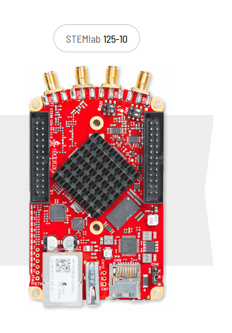

# Red Pitaya (125-10, 125-14)

## Developers

SARAO:  Wesley New, Amish Patel, Marc Welz, Adam Isaacson

UC Berkeley: Jack Hickish

ISU: Brian Bradford

## Description

The Red Pitaya is a very low-cost COTS Zynq FPGA board with on-board ADCs and DACs. There is a single 1Gbps Ethernet port.  The board is used as a low cost CASPER ADC, DAC and signal processing board for education and low performance instrumentation. There are currently two versions available from STEMlab: 125-10 and 125-14.

The 125-10 consists of a 10 bit dual channel ADC and a 10 bit dual channel DAC (interleaved). The 125-14 consists of a 14 bit dual channel ADC and a 14 bit dual channel DAC (interleaved). There are other differences too - please see the comparison between 125-10 and the 125-14 below:

[Red Pitaya Hardware Comparison](https://redpitaya.readthedocs.io/en/latest/developerGuide/125-10/vs.html)

The Red Pitaya is delivered with working software that can configure the Red Pitaya into a fully functional piece of lab test equipment i.e. the Red Pitaya can perform the following functionality:

1) Oscilloscope
2) Signal Generator
3) Logic Analyzer
4) Spectrum Analyzer
5) LCR Meter
6) Bode Analyzer
7) Vector Network Analyzer

## Ordering

The Red Pitaya can be ordered from the manufacturer STEMlab: [Red Pitaya Web site](https://www.redpitaya.com/)

NB: Remember to ask for the 6 pin JTAG header to be populated. The Digilent HS2 JTAG can be used: [HS2 JTAG](https://store.digilentinc.com/jtag-hs2-programming-cable/)

## Status
June 2019: The Red Pitaya will be the focus of the Hardware Porting Workshop, which will be in HartRAO, South Africa. It will be utilised for education in order to show the students how to casperise even the low cost hardware platforms, which are more available to universities. 

## Top-Level Specifications

**FPGA**

The Red Pitaya features a XC7Z010-1CL400C Zynq device. See the [Xilinx Zynq Product Table](https://www.xilinx.com/products/silicon-devices/soc/zynq-7000.html#productTable) for more information. It consists of a hard core Processor System (PS) and Programmable Logic (PL). The processor is a Dual-core ARM Cortex-A9 MPCore. 

**ADC**

125-10: 10 bit, 125MSPS/105MSPS, Analog Devices, AD9608, 1.8V Dual Analog-to-Digital Converter

125-14: 14 bit, 125MSPS/105MSPS, Linear Technology, LTC2145-14, 1.8V Dual Analog-to-Digital Converter 

NB: The Zynq pinouts are different between the two versions.

The ADC Data sheets and board schematics are available under:

[Red Pitaya Docs: Github](https://github.com/casper-astro/casper-hardware/tree/master/FPGA_Hosts/RED_PITAYA/docs)

**DAC**

125-10: 10 bit, 125MSPS, Analog Devices, AD9767, 3.3V Interleaved Digital-to-Analog Converter

125-14: 14 bit, 125MSPS, IDT, DAC1401D125, 3.3V Interleaved Digital-to-Analog Converter 

NB: The Zynq pinouts are different between the two versions.

The DAC Data sheets and board schematics are available under:

[Red Pitaya Docs: Github](https://github.com/casper-astro/casper-hardware/tree/master/FPGA_Hosts/RED_PITAYA/docs)

NB: channel 2 is unconnected on the schematics and DAC operates in interleaved mode.

**RAM**

125-10: 2Gb (256MB)

125-14: 4Gb (512Mb)

This interfaces entirely with the programmable software of the Zynq (PS).

**Ethernet**

125-10: 1Gbps and WiFi

125-14: 1Gbps and WiFi

**USB**

125-10: USB 2.0

125-14: USB 2.0

**External I/O**

125-10: I2C, SPI, UART, power micro USB

125-14: I2C, SPI, UART, power micro USB, external ADC clock, Daisy Chain connector

For detailed I/O specifications:

[Red Pitaya Hardware Comparison](https://redpitaya.readthedocs.io/en/latest/developerGuide/125-10/vs.html)

## Schematics

Only the developer schematics is available:

[Red Pitaya Docs: Github](https://github.com/casper-astro/casper-hardware/tree/master/FPGA_Hosts/RED_PITAYA/docs)

## Chassis

Acrylic and Aluminium case available for Red Pitaya. Check out:

[Red Pitaya Accessories](https://www.redpitaya.com/Catalog/c97/accessories)

## Toolflow

The CASPER toolflow supports the 125-10 at the moment. The Red Pitaya Toolflow is available under:

[Red Pitaya Toolflow](https://github.com/ska-sa/mlib_devel/tree/red_pitaya)

There are tutorials on the Red Pitaya under:

[Red Pitaya Tutorials](https://casper-tutorials.readthedocs.io/en/latest/)
