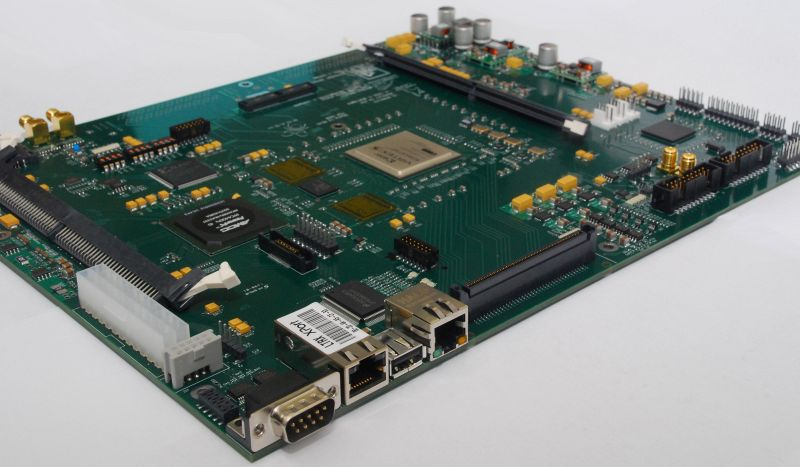
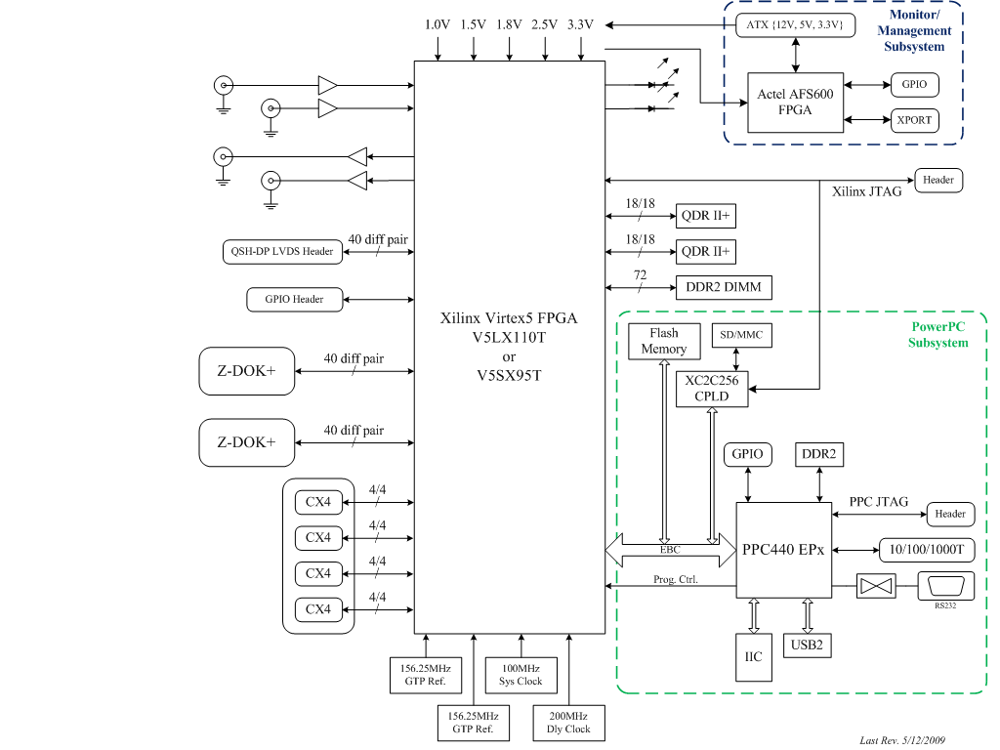
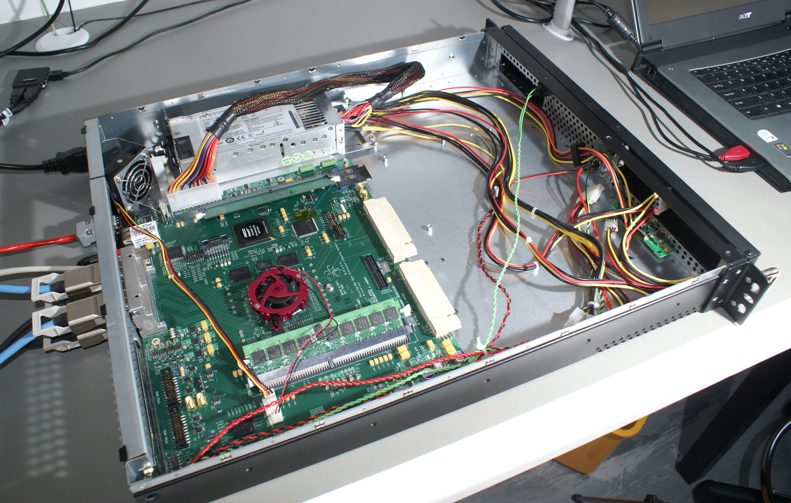
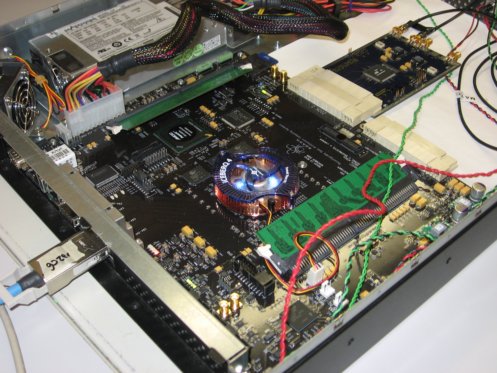

# ROACH

ROACH (**R**econfigurable **O**pen **A**rchitecture **C**omputing
**H**ardware) is a standalone FPGA processing board.

## History

ROACH is a Virtex5-based upgrade to current CASPER hardware. It merges
aspects from the [IBOB](../IBOB/README.md) and [BEE2](../BEE2/README.md)
platforms into a single board. The CX4/XAUI/10GbE interfaces of both are
kept, while combining the Z-DOK daughter board interface of the IBOB
with the high bandwidth/capacity DRAM memory and standalone usage model
of the BEE2. ROACH is a single-FPGA board, dispensing with the on-board
inter-FPGA links in favor of 10GbE interfaces for all cross-FPGA
communications.

## Description

The centrepiece of ROACH is a Xilinx Virtex 5 FPGA (either LX110T for
logic-intensive applications, or SX95T for DSP-slice-intensive
applications). A separate PowerPC runs Linux and is used to control the
board (program the FPGA and allow interfacing between the FPGA "software
registers/BRAMs/FIFOs" and external devices using Ethernet).

Two quad data rate (QDR) SRAMs provide high-speed, medium-capacity
memory (specifically for doing corner-turns), and one DDR2 DIMM provides
slower-speed, high-capacity buffer memory for the FPGA. The PowerPC has
an independent DDR2 DIMM in order to boot Linux/BORPH.

The two Z-DOK connectors allow ADC, DAC and other interface cards to be
attached to the FPGA, in the same manner as the [IBOB](../IBOB/README.md)
allowed (with backwards compatibility for the ADC boards used with the
IBOB).

Four CX4 connectors provide a total of 40Gbits/sec bandwidth for
connecting ROACH boards together, or connecting them to other
XAUI/10GbE-capable devices (such as [BEE2](../BEE2/README.md) boards,
computers with 10GbE NICs and 10GbE switches).

## ROACH Architecture
The ROACH architecture can be broken down into 3 major and relatively independent subsystems. A ROACH board consists primarily of the FPGA subsystem, the PowerPC subsystem, and the monitor/management subsystem.

### Monitor/Mangement Subsystem
The MonMan subsystem of the ROACH board provides remote power control and system status monitoring. An Actel AFS600 mixed-signal FPGA (U60) implements the core functionality. The Actel FPGA handles the ATX power supply's soft power toggling and monitors the voltage and current draw of key power supplies on the board using on-chip ADCs. It can shut down power to the board in the event of a power supply being out of range. This subsystem is powered from the ATX auxiliary 5V power rail, and thus remains on even after a board powerdown.

Remote access to the Actel FPGA is enabled by the Lantronix XP1001001 XPORT (J28). The XPORT encapsulates serial I/O with the Actel in an Ethernet format, which allows switched-network communication with the FPGA.

### PowerPC Subsystem
The PowerPC subsystem is intended to be the primary command/control mechanism for the ROACH board, along with moderate-bandwidth data I/O with the Xilinx FPGA. Its primary component is the AMCC PowerPC 440EPx embedded processor (U1). The PowerPC's functions are supported by DDR2 DRAM (J8), a Spansion 16x32M flash memory (U42), and a National DP83865 10/100/1000 Ethernet PHY (U58). An Xilinx XC2C256 CPLD (U54) acts as an interface to additional I/O capability for the PowerPC, including a MMC/SD memory card socket (J17).

### FPGA Subsystem
ROACH is built around the primary FPGA (U15) for its signal processing capabilities. Either a Xilinx Virtex 5 XC5VLX110T or XC5VSX95T can be populated. The FPGA is connected to a number of peripherals and I/O interfaces; high-bandwidth data I/O is accessible via 2 Tyco Z-DOK+ 40-pair host connectors (P5, P7) and 4 CX4 ports for XAUI/10GbE (P3). Memory is available in both DDR2 DRAM (J15) and QDRII+ SRAM (U17, U63).

## Specifications

- **FPGA**
    - 1x [Xilinx Virtex-5 XC5VLX110T-1FF1136 **or** Virtex-5 XC5VSX95T-1FF1136](http://www.xilinx.com/support/documentation/data_sheets/ds100.pdf) FPGA

<!-- end list -->

- [ **FPGA Interfaces**](documentationROACH_FPGA_Interfaces.md)
    - 2x Z-DOK+ 40 differential pair connectors
    - 4x CX4 10Gbps high-speed serial connectors
    - 1x QSH 40 differential pair connector
    - 16x GPIO
    - 4x SMA IO (2x clock-capable)

<!-- end list -->

- **FPGA Peripherals**
    - 2x 2M x 18-bit QDRII+ SRAMs
    - 1x DDR2 DRAM DIMM

<!-- end list -->

- **CPU**
    - 1x [AMCC PowerPC 440EPx](https://www.amcc.com/MyAMCC/retrieveDocument/PowerPC/440EPx/PPC440EPx_DS2023.pdf) Embedded Processor

<!-- end list -->

- **CPU Interfaces**
    - 1x RS232 DB9 serial port
    - 1x 10/100/1000Mbit RJ45 Ethernet
    - 1x USB2.0
    - 1x MMC/SD card socket

<!-- end list -->

- [ **Monitor and Management**](documentation/Roach_monitor_and_management_subsystem.md)
    - Temperatures of Xilinx Virtex5, PowerPC and Actel Fusion.
    - Voltages of 12V, 5V, 3.3V, 2.5V, 1.8V, 1.5V, 1V and 1.2V aux rails.
    - Automated shutdown in the event of over temperature, over orunder voltage with logging of last shutdown event.
    - Remote power on/off.
    - Separate 100Mbps Ethernet port for independent board control and health monitoring.

<!-- end list -->

- **Block Diagram**
    - [v1.02 Block Diagram (PDF)](block_diagrams/Roach.pdf)

<!-- end list -->

- **Schematics**
    - [v1.01 Schematics (PDF)](schematics/roach_v1_01_sch.pdf)
    - [v1.02 Schematics (PDF)](schematics/roach_v1_02_sch.pdf)
    - [v1.03 Schematics (PDF)](schematics/Roach103.pdf)

<!-- end list -->

- **Gerbers**
    - [v1.0.3 Gerbers](gerbers/Roach103-CAM.zip)

A free PADS PCB viewer is available from
<http://www.mentor.com/products/pcb-system-design/design-flows/pads/pads-pcb-viewer>

## Development

The details about development progression have been moved to its own
dedicated page: [ROACH Development](documentation/ROACH_Development.md).

 
 

## How to get it

Production is managed by Mo at [Digicom](http://www.digicom.org). Send
production-related inquiries to `mo at digicom dot org`. Production is
grouped into batches, so lead times are variable.

## Usage Manuals, Guides, Memos, etc.

- [Getting Started with ROACH](documentation/Getting_Started_with_ROACH.md)
- [Latest firmware and software versions](documentation/LatestVersions.md)
- [Initial bringup, configuration, and test process](documentation/ROACH_Bringup.md)
- [ROACH test machine](documentation/ROACH_test_machine.md)
- [UBOOT and kernel update procedure](documentation/ROACH_kernel_uboot_update.md)
- [Setting up BORPH on ROACH](documentation/Setting_Up_BORPH_on_ROACH.md)
- [ROACH configuration memo (KAT-7 DBE internal memo 008)](documentation/NRF-KAT7-5_0-MEM-008_ROACH_config.pdf‎.md)
- [ROACH onboard monitor and management subsystem](documentation/Roach_monitor_and_management_subsystem.md)
- [KATCP for remote control over the network](documentation/KATCP.md)
- [ZDOK Pin Numbering](documentation/ZDOK_Pin_Numbering.md)
- [ROACH NFS guide](documentation/ROACH_NFS_guide)
- [ROACH Enclosure/Chassis](documentation/Enclosures.md)
- [Latest Versions](documentation/LatestVersions.md)
- [ROACH DDR2 Modules](documentation/ROACH_DDR2_Memory_Modules.md)
- [How to debrick your roach using an open source alternative to OCD commander](documentation/ROACH_Debricking.md)
- [ROACH USB issue and workaround](documentation/ROACH_USB_issue)
- [RFI Tests](documentation/RFI_Tests_of_ROACH_1)
- Sync inputs
    - The Roach1 has (at least) two possible sync inputs:
        - Via the vertical mount SMA receptacle connectors J12. The
          signal input to this connector is terminated into 50 ohms
          and then turned into the LVDS differential pair
          "GPIO\_CLK0\_P" and "GPIO\_CLK0\_N" via an Analog Devices
          ADCMP605BCPE comparator and enters the FPGA at pins G15/G16.
        - Via the vertical mount SMA receptacle connectors J13. The
          signal input to this connector is terminated into 50 ohms
          and then turned into the LVDS differential pair
          "GPIO\_CLK1\_P" and "GPIO\_CLK1\_N" via an Analog Devices
          ADCMP605BCPE comparator and enters the FPGA at pins H14/H15.
    - These pins are available in the standard CASPER tools libraries.

## Contact

For any ROACH issues, submit questions to the CASPER [Mailing List](casper+subscribe@lists.berkeley.edu).
