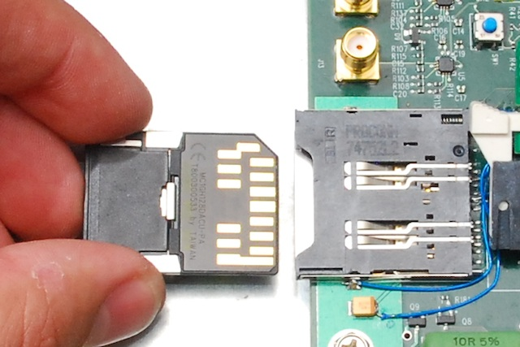

# Getting Started with ROACH

Your ROACH boards ship with all devices already programmed. However,
there are some aspects of the device you may wish to customise before
deployment.

## Shipping Defaults

ROACH ships with the FLASH memory containing uBoot (a simple bootloader
including some ROACH-specific commands), a custom Linux kernel for the
PPC and a stripped-down Linux root filesystem called Busybox.

  - X-port IP Address: 192.168.4.20
  - PPC Ethernet port IP address (uBoot): not configured.
  - PPC Ethernet port IP address (busybox): not configured. Use *busybox
    ifconfig eth0 ...* to configure.
  - PPC Ethernet port IP address (debian etch off USB): not configured
  - PPC Ethernet port IP address (debian etch off network boot): DHCP
  - PPC Ethernet port MAC address: Software reconfigurable, defaults to
    02:00:00:xx:yy:zz where xxyyzz is the serial number of the board.
  - Hostname under linux: not set. Defaults to any supplied DHCP option.

To change the IP address of the X-port, connect to its web interface and
use the supplied GUI. There is also a telnet server on port 10001.

The MAC address of the PPC 1GbE port can be changed in uBoot with the
command *setenv ethaddr xx:xx:xx:xx:xx:xx*. Any changes are volatile and
requires a *saveenv* command to store them on flash.

## The front panel

There are two switches and two LEDs on the front panel.

  - Pressing the **power switch** briefly will power the board on. Hold
    it down for \~7 seconds to power off.
  - Pressing the **reset switch** performs a hard reset. By default, the
    board will remain in the powered-off state after a hard reset. This
    behaviour can be changed by setting a bit of the SYS\_CTRL register
    on the Fusion. See documentation on the ROACH Monitor for further
    information.

<!-- end list -->

  - The **green LED** indicates power.
      - Off indicates no power at all.
      - Flashing indicates AC power is present, but the board is powered
        down.
      - Constant on indicates that the board is powered up.

<!-- end list -->

  - The **red LED** indicates an error condition.
      - Off indicates nominal operation (no error).
      - On indicates a warning threshold has been exceeded (temperature
        or voltage). The board will continue to operate under this
        condition.
      - Flashing indicates that the board automatically powered down due
        to an error. Either a voltage rail or temperature was overrange.

## The boot procedure

You can watch the boot procedure by connecting a serial port configured
for 115200,N,8.

The PowerPC loads uBoot, checks memory and network. Unless you press a
key to interrupt the boot process (over the serial port), it will load
Linux. The kernel's default boot parameters will load Busybox from
flash. With no additional hardware, you can use Busybox by logging in as
"root", with no password.

### How do I soft-reboot the board?

  - From uBoot: *restart*
  - From Busybox: *busybox reboot -f*
  - From supplied Linux: *reboot* or *shutdown -r now*

## Adding your own Linux filesystem

The preferred filesystem is based on Debian Etch. It is over 200MB when
unzipped and does not fit on the onboard flash, so you will need to host
it on a network share or on an external drive.

### USB stick

Download [this file](http://casper.berkeley.edu/svn/trunk/roach/sw/binaries/filesystem/filesystem_etch_2010-03-24_sd_shipping.tar.gz).

This filesystem should be placed on either a USB drive or a MMC/SD card;
see below for more information on getting the SD/MMC interface running.

Unzip it and place it on an **ext2** formatted USB stick. It must be the
first partition on the USB stick. Plug it into ROACH and turn on. You
will need a serial cable connected to interrupt the standard boot
process and altering the default boot process. Press any key when
prompted to interrupt booting from flash, and type

`run usbboot`

This will boot the Linux kernel from onboard flash, but attempt to mount
*/dev/sda1* as your root filesystem. The default is to mount the
filesystem **read only**. If you want **read/write**, at the uboot
prompt,
type

`setenv usbboot setenv bootargs console=ttyS0,115200 mtdparts=\$\{partitions\} rootdelay=8 root='/dev/sda1 rw'\; bootm 0xfc000000`

These changes are volatile. ROACH will only boot this one time off USB,
next time it will again default to booting off onboard flash after the
usual 10 second timeout, unless you alter you environment variables...

#### How do I save the changes?

To change the default boot action change the 'bootcmd' environment
variable:

`setenv bootcmd run usbboot`

Then save the changes to non-volatile flash:

`saveenv`

To permanently allow the filesystem to be mounted read/write, in
/etc/rcSimple change the line:

`mount -n -o remount, ro, noatime /`

to:

`mount -n -o remount, rw, noatime /`

#### What if mount fails?

If the boot sequence fails to mount the usb stick's first partition, it
will dump you into a shell on a read-only filesystem. This means that
something is broken, and you should fix it. But as an interim solution,
you can manually `mount` and `pivot_root` to the usb stick.

``` bash
mount /dev/sda1 /mnt/disk
mount -o loop /mnt/disk/roach /mnt/loop
pivot_root /mnt/loop /mnt/loop/mnt/pivot
PATH=$PATH:/mnt/pivot/sbin:/mnt/pivot/bin
umount /mnt/pivot/proc
mount -t proc proc /proc
```

### SD/MMC boot

The ROACH flash slot accepts Secure-Digital (SD) and Multimedia Memory
Cards (MMC) cards upside-down.


The first-generation of ROACH boards' firmware does not include a
controller for this card that is accessible from the PPC. Kernel support
is also required. As such, the CPLD requires a reflash and U-boot and
the kernel need to be updated before the SD/MMC slot can be used. You
will need a standard Xilinx JTAG programmer for this. See [Enabling the MMC card slot](Enabling_the_MMC_card_slot) for details on how to get the SD/MMC card slot up and running.

The filesystem must be placed in the first partition on the card,
formatted as ext2, as outlined above for the USB boot method.

Once the MMC interface is configured, you can boot from the MMC via the
command:

`run mmcboot`

There is no DMA on the SD/MMC interface. The CPU polls the CPLD,
resulting in higher CPU usage and lower performace. Expect read speeds
of about 4MB/s and write speeds of just under 1.9MB/s. We recommend that
you set *noatime* to your mount options to improve read/write
performance.

### NFS Boot

ROACH can boot off a network. This is useful if you have lots of ROACH
boards and only want to maintain one kernel/filesystem. uBoot can pull
all the necessary parameters from DHCP. You will need to preconfigure a
server on the network to supply a root filesystem as well as a suitable
kernel (not covered here). You can download a suitable Debian Etch
filesystem
[here](http://casper.berkeley.edu/svn/trunk/roach/sw/binaries/filesystem/filesystem_etch_2009-11-30.tar.bz)
and the kernel
[here](http://casper.berkeley.edu/svn/trunk/roach/sw/binaries/linux/).
Your local DHCP server should then provide the locations of these
services to the ROACH board. More information can be found in the [ROACH NFS guide](ROACH_NFS_guide).

#### uBoot commands

When ROACH boots, interrupt it at the uBoot prompt. Run the script
called netboot:

`run netboot`

This will obtain the necessary boot information and boot Linux by
executing the following three uBoot commands sequentially:

`dhcp`  
`setenv bootargs console=ttyS0,115200 root=${rootpath}$ ip=dhcp`  
`boot`

If your ROACH does not have this command (*netboot*), either run the
aforementioned commands manually, or reset your environment settings
back to default using the *clearenv* command to recover it. Bear in mind
that this will erase your uboot settings, including erasing your preset
MAC address. You will need to reenter this using *setenv ethaddr
xx:xx:xx:xx:xx:xx (MAC address suggestion: 02:00:00:serial\_number)* in
order to get the network working.

These settings are volatile. Next time ROACH reboots, it will again boot
off the onboard FLASH device, unless you save the changes...

#### How do I save the changes?

To change the default boot action change the 'bootcmd' environment
variable:

`setenv bootcmd run netboot`

Then save the changes to non-volatile
flash:

`saveenv`

## What do all the board-mounted LEDs mean and what are all the connectors, jumpers and DIP switches for?

The LEDs are all soft-function, and their functions are thus not
labelled on the board. The DIP switches are also soft function and by
default will change some boot parameters. They should all be off by
default.

For further information, see this document: [ROACH configuration memo (KAT-7 DBE internal memo 008)](NRF-KAT7-5.0-MEM-008_ROACH_config.pdf‎)

## How do I talk to my ROACH over the network?

[KATCP](KATCP) is the preferred communication protocol for
talking to your applications over the network. This allows you to
remotely program the FPGA with your bitstreams and control onboard
registers, brams and network interfaces.

If you want to perform housekeeping functions (remote powerup or health
monitoring like temperatures, fan speeds and voltage rails) take a look
at the
[roach\_monitor.py](http://casper.berkeley.edu/svn/trunk/roach/sw/roach_monitor/roach_monitor.py)
Python script.

## How do I update the firmware and software on my ROACH?

You can update your onboard flash without any special hardware using
your existing uBoot. This will allow you to update uBoot itself, the
onboard Linux kernel and Busybox filesystem. There are precompiled
binaries of this software available
[here](http://casper.berkeley.edu/svn/trunk/roach/sw/binaries/). See the
guide on this wiki, [here](ROACH_kernel_uboot_update), for
detailed instructions.

The CPLD and Actel Fusion parts can only be updated using JTAG chains,
which will require suitable programmers. This is beyond the scope of
this guide. See [ROACH\_Bringup](ROACH_Bringup) for further
info.
