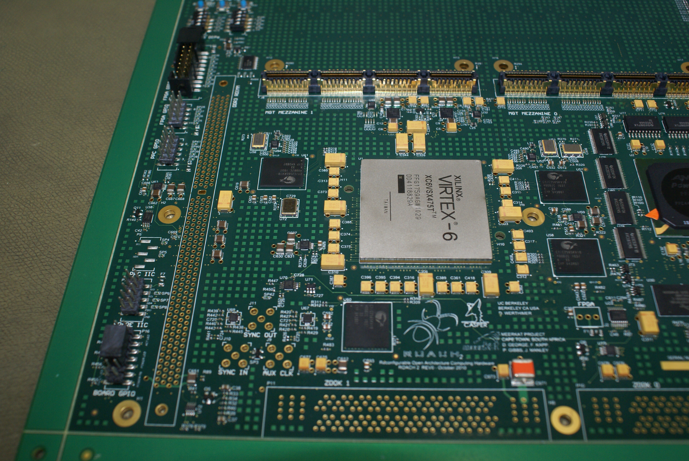
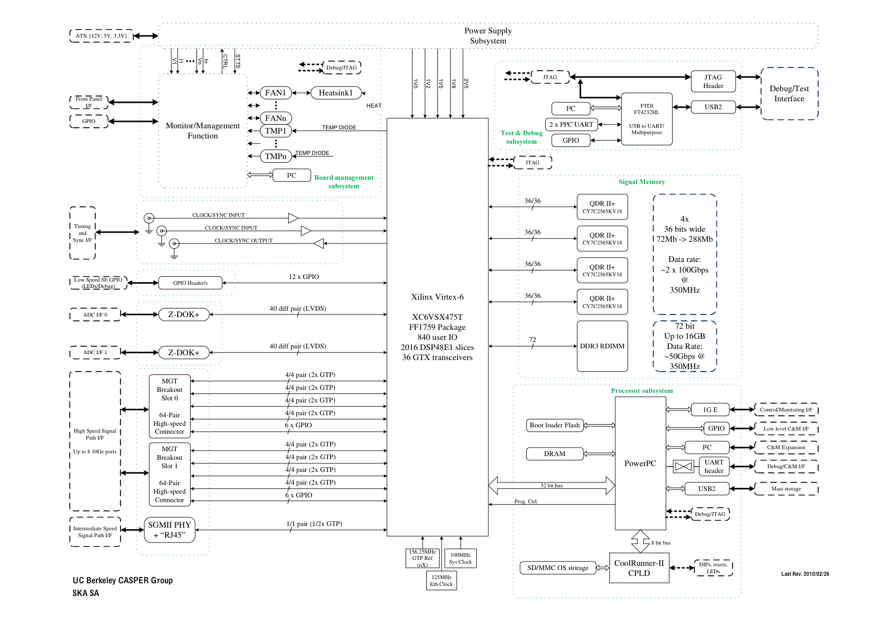
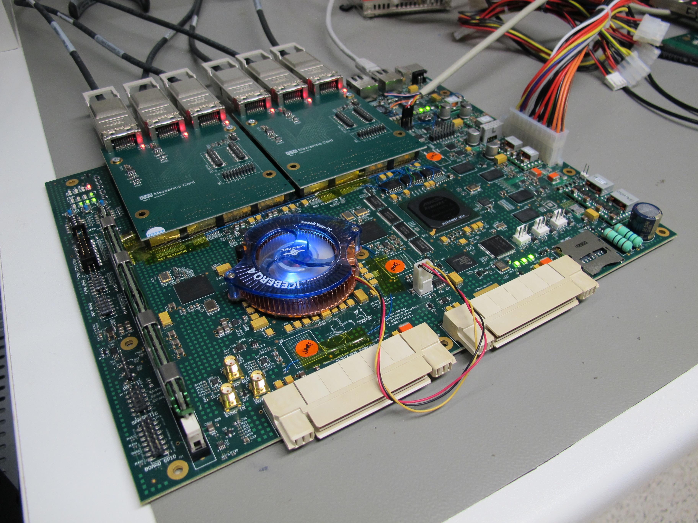

# ROACH-2

**NOTE: This information on this page is taken from the ROACH2-rev2 page of the CASPER wiki, and may require updating**

ROACH-2 is a stand-alone FPGA board and is the successor to the original [ROACH](../ROACH/README.md) board. ROACH stands for Reconfigurable Open Architecture Computing Hardware.

## Background

ROACH-2 was designed as the sequel to ROACH-1 using the new Xilinx Virtex-6 series of FPGAs. It maintains all the aspects that made ROACH-1 a success, but increases the overall performance in terms of processing power, IO throughput and memory bandwidth. It uses the same PowerPC 440EPx present on the ROACH-1 but adds a unified JTAG interface provided through an FTDI FT4232H IC.

## Design Features

 The ROACH-2 design includes the following notable features:

- Virtex-6 SX475T FPGA (XC6VSX475T-1FFG1759C)
- PowerPC 440EPx stand-alone processor to provide control functions
- 2 x Multi-gigabit transceiver break out card slots, supporting up to 8x10Ge links which may be CX4 or SFP+
- 4 x 36 \* 2M QDR II+ SRAMs connected to the FPGA
- A single 72-bit DDR3 RDIMM slot connected to the FPGA
- 2 x ZDOKs
- An FTDI FT4232H USB to JTAG, serial and IIC

## Block Diagram

The current block diagram is shown below: 

## Project Status

The first prototypes have been assembled and are currently being tested.

### Github repository

A Github repository is used to host all the ROACH-2 design files.

### Schematics

You can find the final revision 2 (the third prototype) schematics [here](schematics/roach2_rev2_schematics.pdf)

### Design Files

You can find all the design files for the first prototype, including
gerbers, [here](https://github.com/ska-sa/roach2_hardware/tree/master/release/rev2/A)

The roach2.PcbDoc and various schematics files like qdr0\_1.SchDoc may be viewed on Windows computers using Altium's free viewer found at <http://www.altium.com/community/downloads/en/downloads_home.cfm> specifically the 131 MB file at
<http://downloads.altium.com/altiumdesigner/AltiumDesignerViewerBuild9.3.0.19153.zip>
No registration is required and installation is simple.

## Design

ROACH-2 was primarily specified for the packetised correlator, which was
considered to be the most demanding application. A number of
configurations were considered, including PAPER, ATA and MeerKAT's
upcoming requirements. The calculations for memory sizing, datarates
and bus widths can be found [here](documentation/ROACH2_packetised_correlator_sizing.md).

The ROACH-2 REV 2 Prototype Boards went into production in August 2012
and include modifications intended to address some of the issues
encountered in the previous revision.

These modifications include :

- Isolation of the 3V3 and 3V3Aux devices to prevent backpowering
- Splitting of the I2C Bus between the 3V3 and 3V3 devices
- The PPC crystal oscillator has been replaced with a clock oscillator
- Certain ZDOK lines moved to different banks on the FPGA
- The 6.8mm battery holder has been replaced with a CR2032(20mm) holder
- An additional PPC LED as well as a redesigned LED layout
- Redesigned "Power Override" and "AutoStart" circuitry
- JTAG Isolation

## Mezzanine Cards

ROACH-2 introduces slots for two multi-gigabit transceiver mezzanine
cards. This add flexibility to choose whichever 10Ge physical layer is
most convenient. It also provides an opportunity to research high-speed
ADCs.

A CX4 version of this card has been designed and tested. The card
supports three CX4 ports, a fourth set of XAUI signals is taken to two
headers. There are an additional 6 x 1.5V CMOS IOs taken to a gpio
connector. The CX4 port support active cables. More information is here:
[CX4](../../Mezzanine_Boards/Data_Transport/CX4/README.md) (3 x CX4 Mezzanine board)

A quad SFP+ version is in progress. See [SFP+](../../Mezzanine_Boards/Data_Transport/SFP+/README.md) (Quad SFP+ Mezzanine board).

## Production

Prototype run of three boards completed with Digicom in August 2012.

Pre-production run of 7 boards planned for September 2012.

Full production still TBD.

## Toolflow

Currently the MMSGE toolflow will only support 11.4-5 ISE/EDK tools. The board support package supports any ISE version beyond 11.4. In the long term we need to get the MSSGE tools working with newer tools.

## Documentation

A ROACH-2 datasheet can be found [here]
(https://github.com/ska-sa/roach2_hardware/blob/master/release/rev2/A/ASSEMBLY/ROACH2-REV2%20Datasheet.pdf)

## Testing/Bringup Status

The boards are currently being tested. Check back soon for further
updates.

## Updating tcpborphserver 3 etc.

Grab the latest versions from [here](https://github.com/ska-sa/roach2_nfs_uboot/).

If you netboot: copy tcpborphserver3 to
nfs\_root\_directory/usr/local/sbin. Tcpbporphserver3 will load
automatically when the roach boots.

If you soloboot (boot the root file system stored in flash), which is
the easiest please follow these instructions:

You need to update to the latest romfs which includes the new
tcpborphserver3.

To update:

ROACH2 Test machine set-up instructions: [setup instructions (google doc)](https://docs.google.com/a/ska.ac.za/document/d/1tqw4C6uZ6EULl1OykTFL_vQTnK52UBr0aYqTg44E5wg/edit)

1.  Set up a tftp and dhcp server (see the tftp section in the test
    machine setup instructions).
2.  Create a symlink or rename the romfs image downloaded from github to
    romfs e.g. "ln -s roach2-root-readdebug-2013-02-12.romfs romfs" in
    the tftp directory.
3.  Connect to the roach via USB using a terminal emulator: In linux we
    use minicom, please follow the minicom setup instructions in the
    document.
4.  Switch the roach on or reset and interrupt the boot process
5.  At the uboot prompt type: run tftproot
6.  This takes a long time\! About 5 minutes.
7.  type "reset" and let the board boot linux
8.  Login using root (password is blank)
9.  rm /usr/.keep
10. reboot -f

If you do not which to run a dhcp and tftp server you can use "run
newroot". This macro starts a y-modem receiver, the file can now be sent
using minicom via y-modem protocol, but this takes a long time and you
really need a dhcp server unless you are going to set the roach ip
address manually. You can set the IP address by editing
/etc/network/interfaces

To measure temperatures, voltages and currents:

All sensors are available using kcp commands. You can telnet to the
board to run kcp commands (telnet board\_ip 7147) or if you have access
to the console you can run the commands using the program kcpcmd
("kcpcmd sensor-list" note that there is no
?)

`?sensor-list - lists all the sensors`  
`?sensor-value - lists all the current values`  
`?sensor-sampling sensor_name event - this will give updates when the sensor changes.`

## Enclosure

[ROACH-2 Enclosure](enclosure/README.md)

## ROACH DDR3 Modules

### Summary Table

| Make     | Model #           | Size | FPGA Slot |
|----------|-------------------|------|-----------|
| Kingston | KVR1333D3S8R9S/1G | 1GB  | Yes       |
| Samsung  | M393B5773CH0-CH9  | 2GB  | Yes       |

### FPGA Memory
Due to the controller constraints on the FPGA, only a few DIMMS are supported.

## Usage Manuals, Guides, Memos, etc.

- Sync inputs
    - For Roach2 rev1 and Roach2 rev2 there are at least two possible
    sync inputs:
        - via the vertical mount SMA receptacle connector J10. This
        signal is terminated into 50 ohms and then turned into the
        LVDS differential pair "AUX\_SYNCI\_P" and "AUX\_SYNCI\_N"
        via an Analog Devices ADCMP605BCPZ comparator and enters the
        FPGA at pins BB16 and BB17.
        - via the vertical mount SMA receptacle connector J9. This
        signal is terminated into 50 ohms and then turned into the
        LVDS differential pair "AUX\_CKL\_P" and "AUX\_CLK\_N" via
        an Analog Devices ADCMP605BCPZ comparator and enters the
        FPGA at pins AV16 and AW16. These pins are designated as
        single region clock capable (SRCC) and thus are apt to be
        better suited to drive signals with stricter timing
        requirements (high speed, numerous loads, ...)
        - These pins are in the standard Roach1 design libraries but
        the updated GPIO block in the ADC16 gateware repository may
        be required for the Roach2 rev 2.
