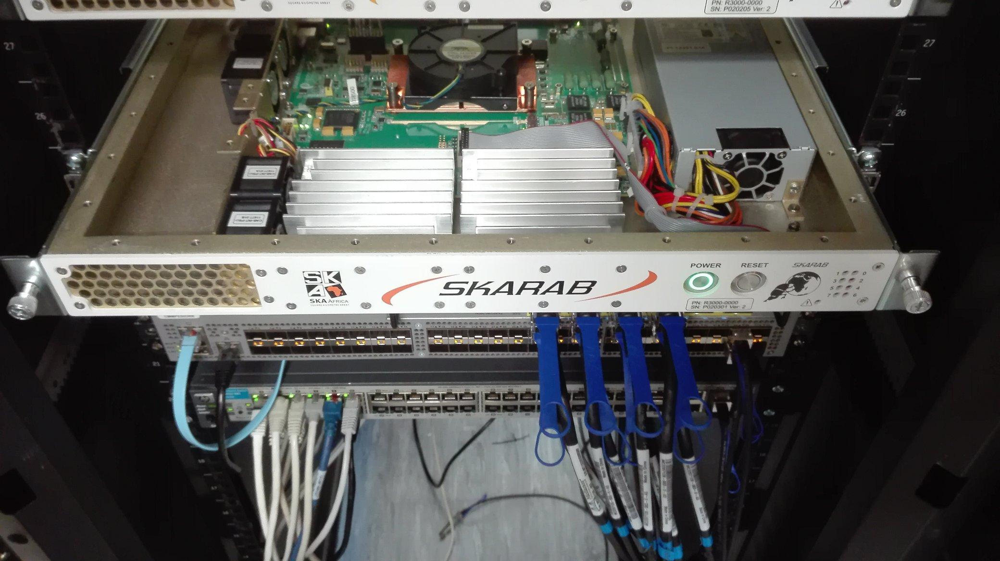
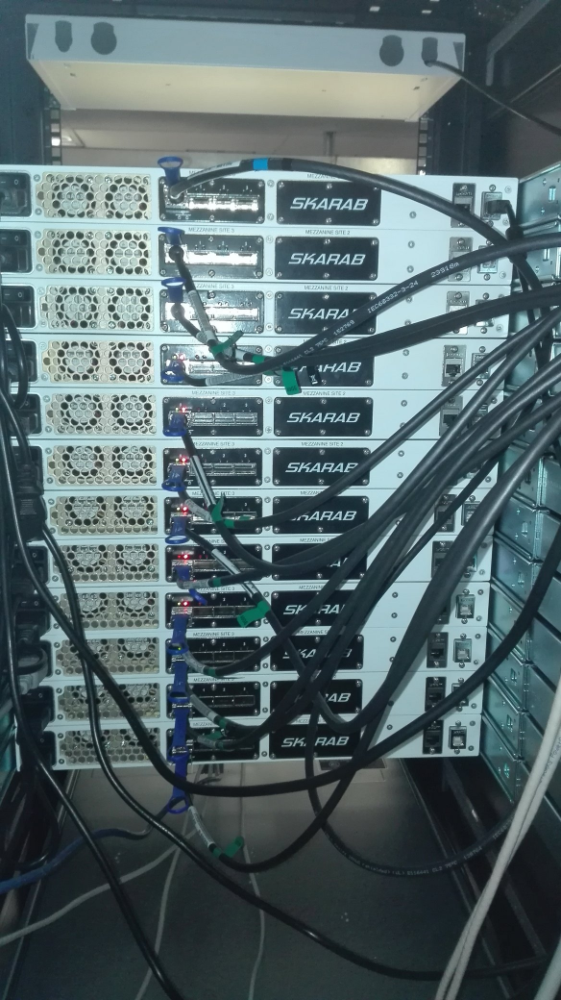
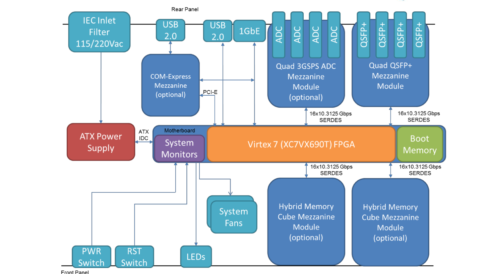
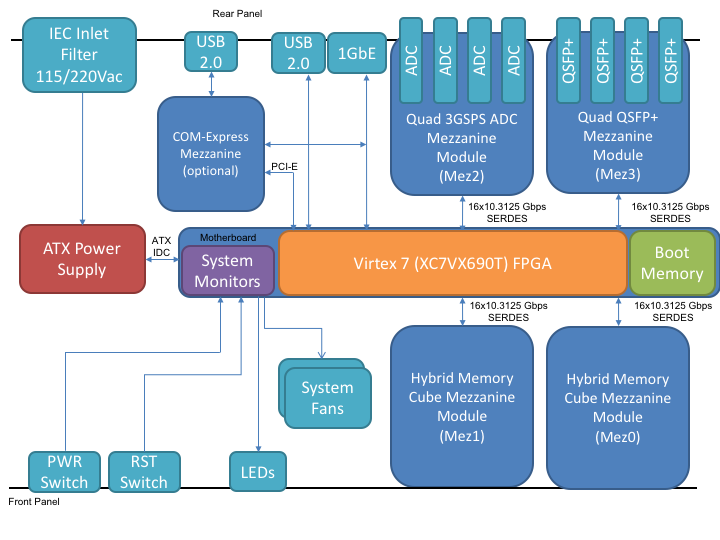

# SKARAB

## Background

SKARAB is an agile, networked, FPGA-centric cluster computing or
instrument node. The Square Kilometre Array Reconfigurable Application
Board (SKARAB) is the latest generation of CASPER FPGA hardware. It is
the next generation/successor to the [ROACH2](../ROACH2/README.md)
platform. Unlike previous CASPER platforms, the SKARAB was designed by
the South African company, Peralex, according to the specifications of
SKA-SA. SKARAB can be purchased from Cyntony Corporation (USA) outside
of South Africa.

The SKARAB makes provision for four mezzanine card sites with each site
providing an interface to 16 high-speed (10\~Gb/s) serial transceivers.
Three mezzanine cards currently exist for SKARAB: a QSFP+ Mezzanine
Module which provides support for four 40Gb Ethernet interfaces, a
Hybrid Memory Cube (HMC) module providing high memory bandwidth at 4GB
capacity per a module and a ADC Mezzanine Card, compatible with the
SKARAB mezzanine interface has been produced and is currently undergoing
testing and evaluation. The ADC Mezzanine Module provides two
TI AD32RF45 dual 3 GSPS 14-bit ADC chips with DDC, for four A/D
channels per mezzanine card.

The SKARAB board does not include an on-board CPU, though provision has
been made for the COM Express mezzanine site which can interface with an
external processor via single lane PCIe. Instead, control of the board
has been implemented using a Microblaze soft processor core.

SKARAB boards have recently been made available to the general
community, with SAO using two and the MeerKAT project planning to deploy
300 boards by the end of 2017.

## Design Features

SKARAB is an integrated 1U rack-mountable box that contains a large PCB
populated with a Xilinx Virtex 7 FPGA possessing 693120 logic cells, 80
SERDES channels, 1470 x 32kb RAM blocks and 3600 DSP slices. Four
mezzanine card sites are included with 400 pin Megarray connectors, each
providing an interface to 16 high-speed (10 Gb/s SERDES) serial
transceivers. A 1 GbE and 40 GbE system configuration and management
port is included as well as system management electronics, cooling and
power supply. Special design attention was applied to the thermal
design, digital signal integrity and reliability for long-life,
high-performance operation.

The SKARAB design includes the following notable features:

  - A Full-Platform Solution
  - 1 x Virtex-7 XC7VX690T FPGA (XC7VX690T-2FFG1927C) for running the
    user DSP algorithms
  - Microblaze softcore processor running on the Virtex 7 FPGA to
    provide control functions
  - 4 x MegaArray transceiver Mezzanine card slots, supporting up to
    16x10Gb/s links which may be utilised for HMC, ADC and QSFP+
  - 1 x QSFP+ Mezzanine Card with 4 x 40GbE full duplex ports
  - Optional: 1-3 x HMC Mezzanine Cards capable of operating at 32Gbps,
    256bit data transfers, full duplex operation
  - Optional: 1 x ADC Mezzanine Card, 4 channel, 14 bits, 3.0 GSPS
  - 1GbE Ethernet RJ45 interface
  - 1 x 256Mb SDRAM for dynamic FPGA configuration connected to the
    Virtex 7 FPGA and SPARTAN device
  - 1 x 1Gb NOR Flash, MT28GU01GAAA1EGC-0SIT for the Virtex 7 FPGA
    golden and multi-boot image storage
  - A single COM Express mezzanine site that can be connected to an
    external processor via single lane PCIe
  - 1 x SPARTAN 3AN FPGA (XC3S700AN-4FGG484C) to handle the Virtex 7
    FPGA dynamic reconfiguration
  - An FTDI FT4232H USB to JTAG, serial and IIC
  - Power: Input 115/220 Vac

<table style="margin: 0 auto;">
<tr>
<td> 

</td><td> 

</td><td> 

</td><td> 

</td></tr></table>

## Block Diagram

The current block diagram is shown below:

MeerKAT does not use the SKARAB ADC, as all the sample is done at the line-feed and instead this is populated with another HMC module.

## Project Status

The SKARAB hardware is in full production.

### Github repository

A Github repository is used to host all the SKARAB design and toolflow
files. The repo structure is as follows:

1\) [mlib_devel](https://github.com/ska-sa/mlib_devel) (devel/master branch). This
contains the JASPER toolflow - Simulink, Matlab and Python scripts to
generate the fpg file from the Simulink model.

2\) [casperfpga](https://github.com/ska-sa/casperfpga) (devel/master branch). This
represents our comms interface to the SKARAB via the microblaze - Python
scripts.

3\) [skarab_bsp_images](https://github.com/ska-sa/skarab_bsp_images) (master branch). This
represents the latest SKA-SA board support package (BSP). It has been
built on top of the original Peralex BSP package, but modified to
support our requirements. The latest SKA-SA BSP is sitting at the following versions:
FPGA=3.1, FPGA SOC=2.8, uBlaze = 3.20.331. There are two images that need to be configured for each SKARAB:
Multiboot image (skarab\_fgbe\_1gbe\_XXXX-XX-XX_XXXX\_multiboot.hex or \*.bin) and the
Golden Image (skarab\_fgbe\_1gbe\_XXXX-XX-XX_XXXX\_golden.hex or \*.bin). The
SKARAB always boots up with the Multiboot image and if there is an issue
with the programming of the toolflow image or Multiboot image then the
board will boot with the Golden image (default safe image). The
Multiboot and Golden Image are identical, except for the boot
parameters. The Golden Image is loaded into the FPGA at a lower clock
frequency to ensure the board boots. The casperfpga ReadtheDocs explains
how to configure the board. There are also other programming files in
the repo. The \*.mcs is used to configure the flash device using Vivado
and the JTAG (you will not need this during normal operation). The
\*.ufp image is used to configure the SPARTAN device on the SKARAB (you
will not need this during normal operation).

4\) [skarab_microblaze_software](https://github.com/ska-sa/skarab_microblaze_software) (master
branch). This repo contains the source code of the microblaze. All you
need to do is run the makefile to generate the elf file, if you decide
to make new changes to the source. There is a readme.txt file that
explains a bit more. The elf file that will be generated needs to be
copied to the
"ska-sa/mlib\_devel/jasper\_library/hdl\_sources/skarab\_infr/cont\_microblaze"
folder. Once this is done you will need to link this file to the
EMB123701U1R1.elf link by typing in "ln -s \<new\_elf\_name.elf\>
EMB123701U1R1.elf (remember to delete the old link first). You are now
ready to use the JASPER toolflow with the new elf file.

5\) [This repo](https://github.com/casper-astro/casper-hardware/tree/master/FPGA_Hosts/SKARAB) contains all the how-to, install and manual documents for the SKARAB.

### Schematics and Design Files

1\) Please enquire at SKA-SA for more information related to schematics
and design files [SKA-SA email](mailto:info@ska.ac.za)

2\) Please enquire at Peralex for more information related to schematics
and design files [Peralex email](mailto:peralex-information@peralex.com)

## Design

In order to meet the new F-engine and X-engine requirements for the
MeerKAT radio telescope new hardware is required. The SKARAB has been
designed to replace the [ROACH2](../ROACH2/README.md) hardware, which is
legacy hardware by providing these new requirements. In particular, the
following critical requirements have been addressed:

  - The need to accommodate a 32K FFT and above
  - The need to handle a processing rate of 32Gbps due to the increased
    data throughput
  - The need for more on-board data storage and serialised memory to
    handle the throughput =\> the 4GB HMC Mezzanine Card
  - The need to move from 10GbE to 40GbE in order to handle the
    throughput
  - Easier timing closure using the Virtex 7 FPGA, which is currently an
    issue with large ROACH2 FPGA designs
  - Move away from old legacy ISE tools to the latest Xilinx Vivado tool
    set

All documentation related to the SKARAB design can be found under the
following repo:

<https://github.com/casper-astro/casper-hardware/tree/master/FPGA_Hosts/SKARAB/docs>

Refer to the "peralex" folder for a good description of the SKARAB
hardware and firmware design. This should be read in conjunction with
the casperfpga ReadtheDocs documentation, which is located
at:

<https://casper-toolflow.readthedocs.io/projects/casperfpga/en/latest/>

## Mezzanine Cards

The SKARAB makes provision for three Mezzanine cards, which are all in
full production and ready to be ordered:

  - QSFP+ Mezzanine Card
  - ADC Mezzanine Card
  - HMC Mezzanine Card

### QSFP+ Mezzanine Card

The Quad Small Form Pluggable (QSFP+) Mezzanine Card provides the SKARAB
with 40GbE functionality. It consists of 4 x 40GbE QSFP+ ports and the
QSFP+ Mezzanine Card can be placed in any mezzanine slot, but CASPER
readers should be aware that the toolflow only supports mezzanine slot 3
at the moment. This may be addressed in the future. The board is
designed and manufactured by Peralex.

More information on the QSFP+ Mezzanine Card can be found under the
following repo (in the "peralex" folder):

<https://github.com/casper-astro/casper-hardware/tree/master/FPGA_Hosts/SKARAB/docs>

### ADC Mezzanine Card

The ADC Mezzanine Card, SKARAB ADC32RF45X2, is a four channel, 3.0 GSPS,
14 bit analog to digital converter, designed specifically for the
SKARAB. The ADC is capable of digitizing signals from near DC to 3.2/4.0
GHz, at a bandwidth of up to 1.5GHz. The ADC mezzanine card can be
placed on any of the SKARAB mezzanine sites. The board is designed and
manufactured by Peralex.

More information on the ADC Mezzanine Card can be found under the
following repo (in the "peralex" folder):

<https://github.com/casper-astro/casper-hardware/tree/master/FPGA_Hosts/SKARAB/docs>

### HMC Mezzanine Card

The HMC (Hybrid Memory Cube) Mezzanine Card, is a 4GB, serialised
memory, which uses 16 x 10Gbps SERDES lanes to the FPGA per a mezzanine
site. The HMC hardware works using the OpenHMC core designed by Juri
Schmidt who works for the Computer Architecture Group at the University
of Heidelberg [CAG](http://ra.ziti.uni-heidelberg.de/cag/) and
[OpenHMC](http://ra.ziti.uni-heidelberg.de/cag/research/recent-research-projects/openhmc).
The OpenHMC core is designed to be fully configurable, but SKA-SA are
using the configuration: 256 bit data transfer and 4 FLITS per a word.
The board is designed by SKA-SA, but manufactured by Peralex.

**NB:** The hardware is using the Micron HMC MT43A4G80200 4GB 8H DRAM
stack device which is now obsolete.

More information on the HMC Mezzanine Card can be found under the
following repo (in the "peralex" folder):

<https://github.com/casper-astro/casper-hardware/tree/master/FPGA_Hosts/SKARAB/docs>

### Schematics and Design Files

1\) Please enquire at SKA-SA for more information related to schematics
and design files [SKA-SA email](mailto:info@ska.ac.za)

2\) Please enquire at Peralex for more information related to schematics
and design files [Peralex email](mailto:peralex-information@peralex.com)

## Production

Production for the SKARAB hardware is handled by Peralex
[Peralex](http://www.peralex.com/index.html), a South African company.
For more information on production related matters then please speak to
Peralex [Peralex email](mailto:peralex-information@peralex.com). Please
note, SKARAB can be purchased from Cyntony Corporation (USA) outside of
South Africa [Cyntony](http://www.cyntony.com).

  - 2 SKARABs have been delivered to SAO in the US
  - 80 SKARABs have currently been delivered to SKA-SA
  - By the end of Nov 2017, 120 more SKARABs will be delivered to SKA-SA
  - The remainder of the SKA-SA SKARABs (100) will be delivered June
    2018

## Board Support Package

The SKARAB Board Support Package (BSP) firmware is primarily managed by
SKA-SA and includes:

1\) 1 Gb Ethernet core (for health monitoring, control)

  - MAC only (external PHY)
  
  **NB**: There are two versions: a) CASPER friendly, which supports 1GbE and 40GbE and b) MeerKAT friendly, which supports 40GbE only. 

2\) 40 Gb Ethernet core (high speed data and health monitoring, control)

  - MAC
  - PHY (XLAUI/XLPPI to external PHY/QSFP+)

3\) Hybrid Memory Cube controller core (by SKA-SA)

  - uses
    [OpenHMC](http://ra.ziti.uni-heidelberg.de/cag/research/recent-research-projects/openhmc)
    and custom SKA-SA generated firmware

4\) Management microcontroller

  - MicroBlaze uC with Wishbone peripheral bus 

  - 1-Wire Configuration PROM access 

  - Voltage/current monitors (12 rails) 

  - Fan control/status 

  - High speed network-based FPGA boot 

  - Network setup/management for 1 GbE and 40 GbE interfaces (PING,
    DHCP,etc) 

The latest SKARAB BSP images can be found under the following repo:

<https://github.com/ska-sa/skarab_bsp_images> (master branch).

**NB**: The HMC is a yellow block within the toolflow, but is not part
of the SKARAB BSP.

## ToolFlow

The SKARAB toolflow currently uses Matlab R2018a, Xilinx Vivado 2019.1.1
and Ubuntu 14.04 LTS/16.04 LTS. It has not been tested on any other versions and
hence, the results cannot be guaranteed when using different software
versions than those specified here.

The toolflow can be found under the following repos - SKA and CASPER:

<https://github.com/ska-sa/mlib_devel> (SKA master branch)

<https://github.com/casper-astro/mlib_devel> (CASPER master branch)

Refer to the ReadtheDocs link below for how to run the JASPER toolflow.

<https://casper-toolflow.readthedocs.io/en/latest/src/Running-the-Toolflow.html>

You can find documentation on how to install Matlab and Xilinx Vivado
under the following ReadtheDocs link:

<https://casper-toolflow.readthedocs.io/en/latest/>

### SKARAB hardware configurations available

#### Toolflow supported hardware configurations:

The following configurations are supported by the toolflow:

The 40GbE Mezzanine Card can only be fitted to Mez3. The HMC and ADC Mezzanine cards can be placed on Mez0, Mez1, Mez2, but not Mez3.

#### Non-Toolflow supported hardware configurations:

The configurations listed below are not supported by the toolflow and SKA-SA BSP at this stage. 
However, the hardware can support the following configurations of Mezzanine Cards (not shown above):

1) HMC Mezzanine Cards, 4GB, 2 link x 4
2) ADC Mezzanine Cards, 3GSPS, 14 bits, JESD204B, 4 channels x 4

## FPGA Configuration

Note the design intent of SKARAB is that the flash (and backup flash)
images are bootloaders, and should never be reprogrammed/overwritten
with application code (behaving much like the BIOS in a PC). This is in
strong contrast to how most FPGA platforms work, where end users are
accustomed to programming their application into FPGA configuration
flashes. While it is certainly possible to put end user images in boot
flash, this defeats much of the rapid on-the-fly reconfiguration of the
platform. The SDRAM-based reconfiguration should be the only option that
an end user ever needs (unless non-volatility of end user application is
important).  The end user application image should also contain
sufficient support (BSP framework) to support further reconfiguration.
If the end user SDRAM image is corrupted and/or is incorrectly set up to
support further reconfiguration, then a power cycle will cause the unit
to fall back to the bootloader image (boot the flash), and wait for new
application code to be uploaded.

There are currently two bootloader flash images:

  - Golden Image, which is loaded if the SDRAM image is corrupt or
    something goes wrong with the boot up procedure (safe image)
  - Multi-boot image, which is loaded each time the SKARAB is powered up
    and no issues with the configuration occurred (normal image)

**NB**: The latest SKA-SA BSP and toolflow can now configure the FPGA
via the SDRAM interface using the microblaze wishbone interface and no
longer via the fabric interface as specified in the Firmware User
Manual. The fabric interface had the disadvantage of programming the
SDRAM and then computing the checksum afterwards. If there was an issue
then the programming would fail and the board would boot to golden
image. This takes more time and can result in multiple reconfigurations
in a system with many SKARABs, which can influence the observation time.
The new microblaze wishbone interface sends blocks of data and checks
each block of data using the lockstep system. If the block of data is
corrupt or fails then it is resent with a timeout recovery system
built-in. This means that when the SDRAM is programmed the data is valid
and so the board will rarely boot into the golden image. This makes the
programming of the SKARAB more reliable. There is currently a lockstep
mechanism between casperfpga and the microblaze and a lockstep mechanism
between the microblaze and the wishbone programming FIFO.

## Documentation

All documentation related to the SKARAB can be found under the following
repo:

<https://github.com/casper-astro/casper-hardware/tree/master/FPGA_Hosts/SKARAB/docs>

Refer to the "peralex" folder for a good description of the SKARAB
technical specs

## User Guide

### Best Practices

The following is a best practices guide compiled by SAO when trying to
bring up their SKARABs during the period of June 2017, which should also
be available on the CASPER email thread:

1\) We didn’t get anywhere without the right tools software rev levels:
 Matlab 2016b and Vivado 2016.2 Our Mathworks and Xilinx support had
expired due to my own lazyness.  We were informed that older versions
should work, as there are no dependencies critical to these versions,
but there are rev level cross checks in various config files, and we
could not in practice work around these. In the end we asked for 30 day
trials to get by while processing paid renewals.

2\) A documentation error, now corrected,  directed us to the wrong
branch of the Git Repo which obstructed builds. Use the master branch
\*not\*  jasper\_vivado\_2016\_2 branch.  After changing branches it was
also necessary to update the vivado\_config.sh script. **NB**:
jasper\_vivado\_2016\_2 branch has since been deleted.

3\) Loading and running bitcodes on SKARAB: One needs proper rev levels
of the SKARAB Spartan (1.6) and Virtex 7 (2.7) FPGA firmware  (The
latter was known as the “SOC” firmware, now deprecated, and includes the
MicroBlaze processor IP). **NB**: the BSP package has been updated and
is now on version 2.7.

4\) One also needs the correct version of casperfpga utility compatible
with firmware versions. **NB**: this is currently being addressed in
casperfpga.

5\) Our SKARABs shipped with older firmware versions.  In attempting to
update them as a first step one of our SKARABs went into a
non-responsive state, which was referred to as “bricked” on the CASPER
list.  The SKARAB was not in fact strictly bricked, rather it was found
that pacing hostname with the DHCP response (via /etc/hosts and dnsmasq)
then it would continuously keep sending DHCP requests and never actually
boot up with an IP.  We have only best guesses for how we got into this
state: namely used a very old and apparently incompatible version of the
casperfpga utility to first attempt the firmware upgrade via Ethernet.
 Recovery required updating the Virtex 7 firmware via JTAG following
unpublished procedures (it is planned to have to take the lids off
SKARABs in the field).  For reasons we don’t fully understand the
non-responsive unit only recovered on the second JTAG firmware upgrade
attempt—a pleasant surprise at that point, we didn’t look that gift
horse in the mouth. **NB**: this should not be an issue for other SKARAB
users as the SKARAB will be shipped with the latest firmware.

6\) Other smaller issues: There is a need to reprogram the bitcode onto
the SKARAB after exiting and restarting ipython in order to access
software registers and snapshot blocks through casperfpga.

7\) One needs to disconnect the 40 GbE cables from the SKARABs when
uploading bitcodes over 1 GbE, otherwise communication will be lost and
the SKARAB needs to be reset. **NB**: the microblaze now determines the
interface, so this will no longer be an issue.

8\) One needs to enable jumbo packets on 1 GigE networks (Server NIC MTU
size 1500 to 9000); when not enabled caused checksum errors on loading.
 In our case the server NIC was not properly set up.

9\) 40GigE communications: To send data from one SKARAB to another, the
40 GbE ports must be routed through a switch in order for the SKARABs to
be assigned an IP address via DHCP.  A possible alternative is to use a
static IP assignment, but this is not transparently supported in current
JASPER tools and libraries.  Covered in detail by Wesley New and
Clifford van Dyk in this very email thread.

10\) The Jumbo packets issue also arose on the 40 GigE network.  When
trying to send data over 40 GbE from a SKARAB, through the switch, and
into a server, the MTU size had to be set to 9000.
