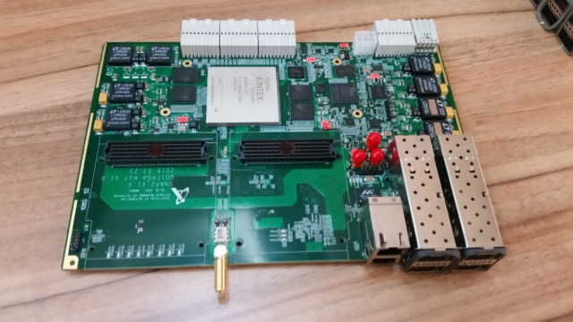
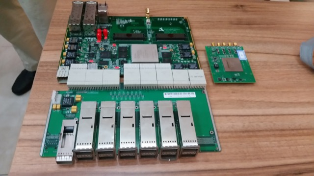

# SNAP2

## Background

SNAP 2 is a Kintex Ultrascale based platform, featuring a Xilinx
XCKU115-FLVF1924 FPGA with 5520 DSP slices and 2160 36kb block RAMs.

## Design Features

- Ultrascale XCKU115-FLVF1924 FPGA.
- Zynq AP SoC XC7Z010
- 4 QDR memories
- 1 DDR3 component memory
- 4 Quad Small Form-factor Pluggable (QSFP) connectors, supporting
  4x40GbE or 16x10GbE interfaces.
- 2 Ethernet PHYs supporting 1000BaseT
- USB interface
- ZD+ connector (this is not ZDOK!)
- 2 high pin count(HPC) FMC connectors

SNAP 2 is being designed by collaborators at the [Institute of
Automation, Chinese Academy of Sciences](http://www.ia.cas.cn/).

A more comprehensive overview of SNAP 2, including a block diagram can
be found [here](documentation/SNAP2_Doc.pdf)

**Update May 2016**: The first prototypes of the SNAP2 board have been
assembled\! Pending testing by the Institute of Automation, one of these
will be sent to Berkeley for integration into the CASPER toolflow.
Photos below...

