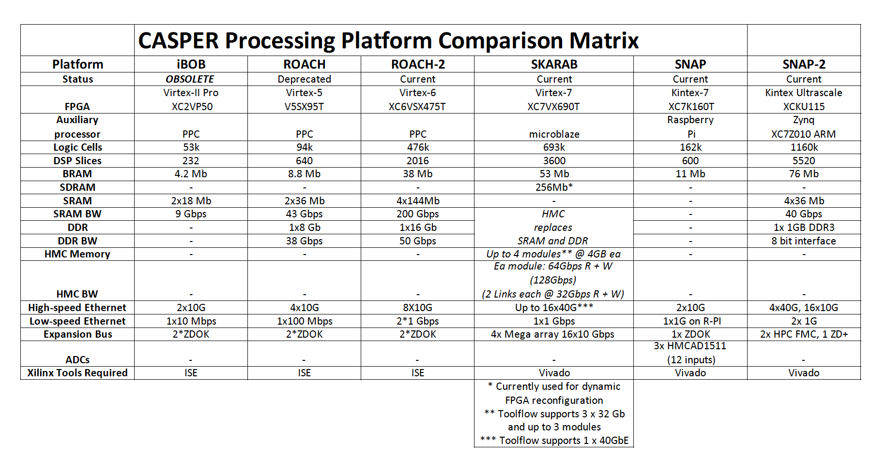

# CASPER Hardware

## Hardware Compatibility Matrix

## Processing Boards

- [IBOB](FPGA_Hosts/IBOB/README.md) (2005 - present | Virtex-II Pro)
- [BEE2](FPGA_Hosts/BEE2/README.md) (2005 - present | 5x Virtex-II Pro)
- [ROACH](FPGA_Hosts/ROACH/README.md) (2009 - present | Virtex 5 SXT95/LXT110/LXT155)
- [ROACH2](FPGA_Hosts/ROACH2/README.md) (2010 | Virtex 6)
- [ROACH-2 Revision 2](FPGA_Hosts/ROACH-2_Revision_2) (2012 | Virtex6)
- [SNAP](FPGA_Hosts/SNAP/README.md) (2014 | Kintex7, 12x250 Msps, 6x500 Msps, 3x1 Gsps): 
  3 x HMCAD1511 ADC's, Kintex7 FPGA, and SFP+ 10Gbe
- [SNAP2](FPGA_Hosts/SNAP2/README.md) (2017) | Kintex Ultrascale)
- [SKARAB](FPGA_Hosts/SKARAB/README.md) (2017) | Virtex 7)

## Mezzanine Boards

### Data Transport

- [CX4](CX4) (3 x CX4 Mezzanine board)
- [SFP+](SFP+) (Quad SFP+ Mezzanine board)
- [SKARAB QSFP+](https://casper.berkeley.edu/wiki/SKARAB#QSFP.2B_Mezzanine_Card) (QSFP+, 40GbE, 4 ports Mezzanine board)

### Data Storage

- [SKARAB HMC](https://github.com/casper-astro/casper-hardware/tree/master/FPGA_Hosts/SKARAB/SKARAB#HMC_Mezzanine_Card) (Hybrid Memory Cube, 4GB, 32Gbps, 2 link, serialised Mezzanine board)

### ADCs

- [ADC2x1000-8](ADC2x1000-8) (2005 - present | dual 1GSa/sec): 
  Dual 8-bit, 1000Msps (or single 8-bit 2000Msps), Atmel/e2v
  AT84AD001B ADC
- [ADC1x3000-8](ADC1x3000-8) (2007 - present | 3GSa/sec): 
  Single-8 bit, 3000Msps National ADC083000 ADC
- [64ADCx64-12](64ADCx64-12) (2008 - present | 64x 50MSa/sec): 
  64 inputs, 64 Msps, 12 bit, double wide board
- [ADC4x250-8](ADC4x250-8) (2008 - present | quad 250MSa/sec): 
  Quad 8-bit, 250 Msps, Analog Devices AD9480 ADC
- [ADC2x550-12](ADC2x550-12) (2009 - present | dual 550 Msps): 
  Dual 12-bit, 550 Msps, TI ADS54RF63I
- [ADC2x400-14](ADC2x400-14) (2009 - present | dual 400 Msps): 
  Dual 14-bit, 400 Msps, TI ADS5474
- [KatADC](KatADC) (2010 - present | dual 1.5GSPS or single 3.0GSPS):
  Dual 8-bit 1.5GSPS (or Single 8-bit 3.0GSPS), National Semiconductor
  *(now Texas Instruments)* ADC08D1520 ADC, RF Front-End
- [ADC1x5000-8](ADC1x5000-8) (2010-present | Single 5.0 or dual 2.5 GS/s, 4/8 bit versions)
- [Next Generation Samplers](Next_Generation_Samplers) (2011+ | \>3GSPS)
- [ADC16x250-8](ADC16x250-8) (Q2 2012 - present): 
  16,8,4 inputs 8 bits 250,500,1000 MSPS, Hittite HMCAD1511, various input formats
- [ADC1x10000-4](ADC1x10000-4) (2012-2016.9 | Single 10.0 GS/s, 4 bit versions):
We have couple of boards available, if interested, please email:homin@asiaa.sinica.edu.tw, all information is:
  [adc10G](http://stacks.iop.org/1538-3873/128/i=969/a=115002)
- [ADC1X2200-10](ADC1X2200-10) (2012 - 2014 | Single 2.2GSPS, 10-bit) ***(Device obsolete/discontinued - will be unavailable for purchase from 11 November 2017. [See product bulletin.](https://casper.berkeley.edu/wiki/images/8/8b/Product_Bulletin_TE2V-PB170811-01.pdf))***: Single 10-bit 2.2GSPS, e2v AT84AS008 ADC & AT84CS001 DMUX
- [Smart Network ADC Processor (SNAP - was DAB-HERALD)](DAB-HERALD) (2014 - | Kintex7, 12x250 Msps, 6x500 Msps, 3x1 Gsps): 3 x HMCAD1511 ADC's, Kintex7 FPGA, and SFP+ 10Gbe
- [SKARAB ADC32RF45X2](https://casper.berkeley.edu/wiki/SKARAB#ADC_Mezzanine_Card) (2017 - | ADC, 4 channel, 3.0GSPS, 14 bit, RF input up to 4.0GHz, JESD204B):
2 x Dual 14 bit TI ADC32RF45 ADC's

### DAC Boards

- [DAC2x1000-16](DAC2x1000-16): Dual 16-bit, 1000 Msps, TI DAC5681

## Suggested Supporting Equipment

- [Cables](Equipment_Cables)
- [ ROACH Enclosures](Enclosures)
- [Recommended 10 GbE Hardware](Recommended_10_GbE_Hardware)
- [Inexpensive Synthesizer Boards](Inexpensive_Synthesizer_Boards)
- [Expensive Synthesizers](Expensive_Synthesizers)
- [CASPER Z-DOK Compatibility](CASPER_Z-DOK_Compatibility)
- [JTAG repeater](JTAG_repeater)
- [16 way 1PPS driver](16_way_1PPS_driver)
- [SMA to Vport adapter](SMA_to_Vport_adapter)
- [SMA to RJ45 adapter](SMA_to_RJ45_adapter)
- [noise sources](noise_sources)
- [32 Way Splitter Clock Distribution](https://casper.berkeley.edu/wiki/images/c/c8/Splitter_clock_distribution_32way_.pdf)
- [Avalanche photo diode (APD)](Avalanche_photo_diode_APD)

### CASPER Manufacturing

CASPER has several manufacturing partners that the group uses to have
its own boards built. If you are interested in purchasing assembled and
tested boards, enclosures, cable assemblies, memory, etc, most CASPER
hardware can be purchased from DIgi-com Electronics,
<http://digicom.org>. All of CASPER's collaborators acquire boards in
this manner when they need low volumes.