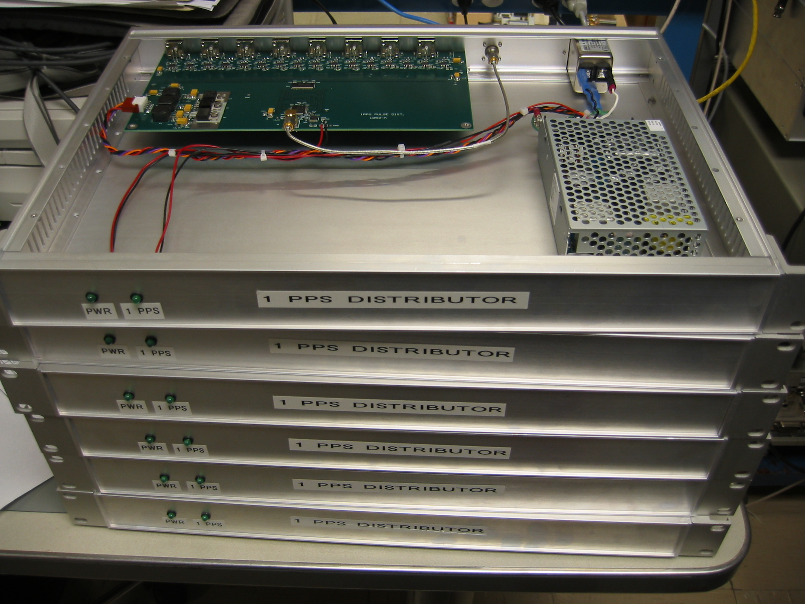
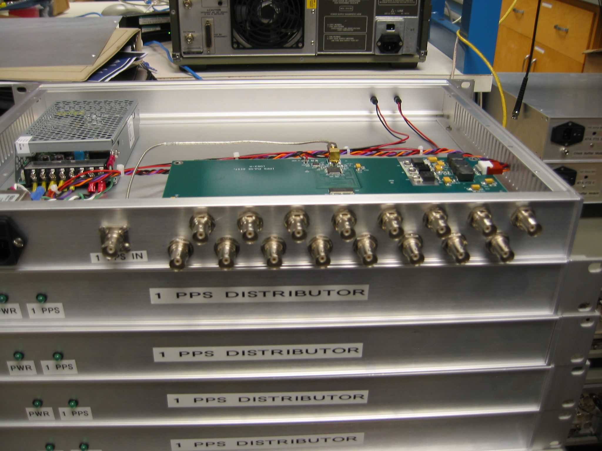
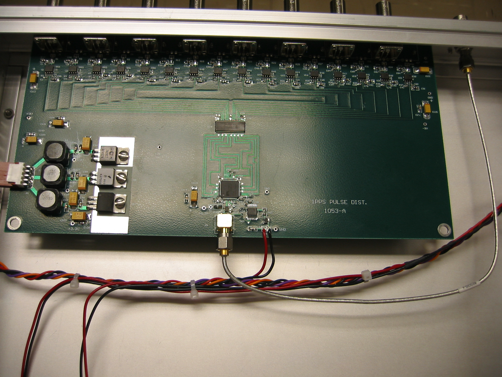
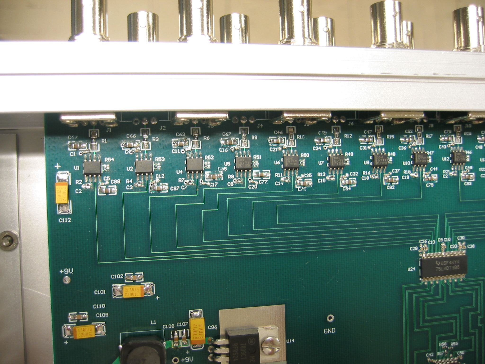

# 16 way 1PPS driver

## RAL's 16 way 1PPS driver

The goal of this active circuit board mounted within a 1U chassis is to
drive 16 identical LVTTL level, when terminated into 50 ohm load,
versions of an input 1PPS clock. The shape of the rising and falling
edges, roughly 1.6 ns, of the DC-3V LVTTL was set to match that of a
COTS Timing Solutions 4032A unit.

The front panel of the chassis has a power LED as well as one that
flashes once per 1PPS. The flash is generated by a pulse stretching
circuit so the LED can be seen by a human because some of the
applications have extremely narrow, 10s of nanosecond, pulses.

Please request more information via the CASPER email list.

## Commercial alternatives

There are commercially available 1PPS drivers in addition to the RAL's
version. Examples include

  - <http://www.meinbergglobal.com/english/products/sdu.htm> 1:12 or
    2:24 way TTL distribution. (in the UK, \~£500 for 1:12, \~£750 for
    2:24).
  - <http://www.pulseresearchlab.com/products/categories/fanout.htm>
    Various drivers available, from 1:4 to 1:22 way distribution.
  - <http://www.thinksrs.com/products/FS730-3.htm> 1:7 way and 2:14 way
    drivers.

## Compatibility warning

It is left to the user to ensure the selected device will meet their
needs.

Some 1PPS drivers only output DC to 2.5V when loaded by 50 ohms while
some 1PPS drivers need at the input 2.7 V or even 3 V before they
consider the input asserted (logic "1"). For example, the Datum 6602b
needs input at \> 2.7 V (and in lab we've measured that the input needs
to swing from DC to more like 3V).

As shown in the test plots below, the RAL part drives Voutput high to
approx 3.3V (into 50 ohm load) and even this is not large enough to
drive all commercial N-way distributors.

The 1PPS or Sync inputs into the CASPER ADC2x1000-8 and ADC4x250-8, and
possibly others, are received by a TI SN65LVDS1 or equivalent part,
along with a 50 ohm termination resistor. For this receiver the 1PPS
signal only needs to get to 2.0V on the input for a logic "1".

The aux\_sync inputs on the Roach2, and possibly others, is not a
standard TTL receiver. Rather the input, J10, is DC coupled to 2.5 VDC
generated by 5V -\> 100 ohm -\> center point -\> 100 ohms to GND. This
signal is one input of a high speed comparator and the other input is
fixed 2.5 VDC. The two 100 ohm resistors in parallel provides a 50 ohm
load to the source. The comparator needs a much smaller swing input than
in standard TTL.

The typical and recommended distribution scheme is each 16 way 1PPS
driver output has 1 and only 1 50 ohm load.

But the Roach2's receiving circuits mean the following low budget and
slightly kludgey 1 output to 4 input schemes are worth considering

  - 4 way split using 4 sets of AC coupling caps
      - [4 way AC coupled splitter (pdf)](documentation/1PPS_4way_passive_split.pdf)
      - This has passed \~ weekend long lab test using 1 16 way 1PPS
        driver output and all 4 outputs loaded.
      - If a 3dB BNC attenuator was included on the input side the
        Roach2s did detect the pulse but the jitter was unacceptably
        high. Cable the 16 way 1PPS driver directly into the 4 way AC
        coupled split.
      - Some observatories, such as Arecibo, have very large, 0 to 12V,
        1PPS signals. These will need attenuation at the input side.

<!-- end list -->

  - 4 way split using BNC tees
      - short lab tests found this to be reliable.
      - at the Roach2's comparator input the signal, as measured by a
        low BW passive probe, was Vmin 1.96 V, Vmax 3.3, Vpp 1.34, clean
        rising edge of 2.6ns
      - 1 output of this 16 1PPS driver -\> 4ft 50 ohm coax -\> BNC tee
        A
          - tee A out 1 -\> BNC tee B
          - tee A out 2 -\> BNC tee C
              - BNC tee B out 1 -\> 6 ft 50 ohm coax -\> Roach2 1
                aux\_sync\_in
              - BNC tee B out 2 -\> 6 ft 50 ohm coax -\> Roach2 2
                aux\_sync\_in
              - BNC tee C out 1 -\> 6 ft 50 ohm coax -\> Roach2 3
                aux\_sync\_in
              - BNC tee C out 2 -\> 6 ft 50 ohm coax -\> Roach2 4
                aux\_sync\_in
  - 4 way split using DC-2000 resistive splitters (MiniCircuits
    ZFRSC-2050)
      - short lab tests found this to be reliable.
      - at the Roach2's comparator input the signal, as measured by a
        low BW passive probe, was Vmin 2.171 V, Vmax 3.0, Vpp 0.84,
        clean rising edge of 2.9ns
      - 1 output of this 16 1PPS driver -\> 4ft 50 ohm coax -\>
        ZFRSC-2050 unit A
          - ZFRSC-2050 unit A out1 -\> ZFRSC-2050 unit B
          - ZFRSC-2050 unit A out2 -\> ZFRSC-2050 unit C
              - ZFRSC-2050 unit B out 1 -\> 6 ft 50 ohm coax -\> Roach2
                1 aux\_sync\_in
              - ZFRSC-2050 unit B out 2 -\> 6 ft 50 ohm coax -\> Roach2
                2 aux\_sync\_in
              - ZFRSC-2050 unit C out 1 -\> 6 ft 50 ohm coax -\> Roach2
                3 aux\_sync\_in
              - ZFRSC-2050 unit C out 2 -\> 6 ft 50 ohm coax -\> Roach2
                4 aux\_sync\_in
  - adding a total of 2 dB attenuators to the Roach2 inputs in the 4 way
    split using DC-2000 resistive splitters (MiniCircuits ZFRSC-2050)
    test above also worked in the lab.
      - at the Roach2's comparator input the signal, as measured by a
        low BW passive probe, was Vmin 1.99 V, Vmax 2.65, Vpp 0.66,
        clean rising edge of 2.9ns
      - note the high side of 2.65 is only 0.15 V above the comparator's
        mid point. There is little margin.
  - adding a total of 3 dB attenuators to the Roach2 inputs in the 4 way
    split using DC-2000 resistive splitters (MiniCircuits ZFRSC-2050)
    test above did Not work.

## Schematics

The PDF version of the schematics may be found at
[16way\_1PPS\_schematics](schematics/RAL_16way_1PP_schematics.pdf).

## Place and Route and Mechanical

The place and route files may be found here:

  - [16way\_1PPS\_top\_layer.pdf](place_and_route/16way_1PPS_top_layer.pdf)
  - [16way\_1PPS\_GERBER\_files.tar](place_and_route/16way_1PPS_GERBERs.tar)

## Assembly

[16way\_1PPS\_driver\_BOM.pdf](assembly/16way_1PPS_driver_BOM.pdf)

Please note how it the above BOM has been customized for the parts to
order for the last 3 units we are now working as of 2011oct20. please
ask if you want the raw ODS spreadsheet file.

More critically for the non-US users : The PSU called out accepts
VACinput only. An international use PSU is identified in the far right
column. That international unit has been used on multiple systems in use
in South Africa and is known to work AOK.

At this time there are no mechanical drawings for the chassis - as in
where to mount the LEDs or BNC connectors.

## Lab Measurements

  - [scope waveforms (PDF)](lab_measurements/16way_1PPS_measurements.pdf)
  - [spreadsheet of sample latencies and rise and fall times (PDF)](lab_measurements/16way_1PPS_measurements_2.pdf)
  - when powered by 120 VAC the current drawn is 0.18 amps. Theta is
    about 0.57. True power is about 12 watts and the VI drawn is about
    21.6
volt-amps.

## Pictures

.

.

## Software

None.

## Chassis

The 1U tall chassis is 12" front to back.

The BNC I/O connectors are another 0.75".

If include a straight VAC power cord is used then the recommended depth
from chassis front face to the back of the rack or an opposite side
mounted chassis is 15". 15" measured from the very front of chassis,
which is about 1/8" outside of the rack face, to the last bend of the
VAC power cord.

The 15-12.75" gap should be enough to connect in not-to-stiff BNC coax
cables. One may have to make connections by touch as there may be no way
to see into that gap.

Typically the front face of chassis has the rack mounting ears and the
LEDS. And the back face as all I/O.

The rack mounting ears can be removed from the LED side and moved to the
I/O side.
