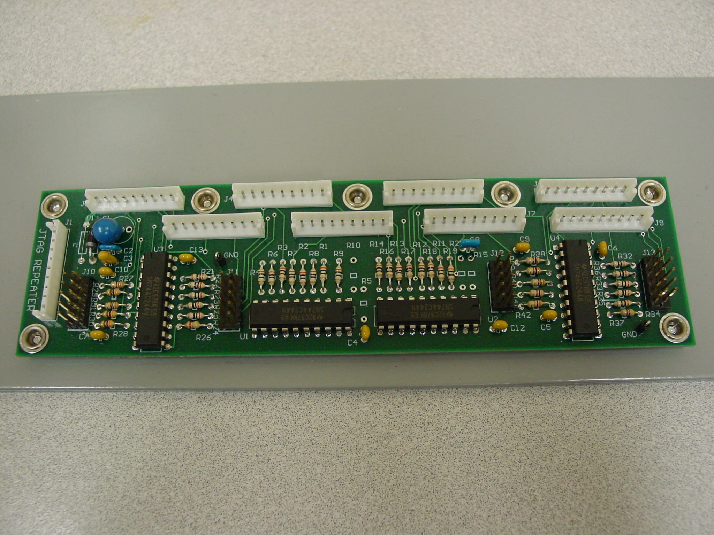
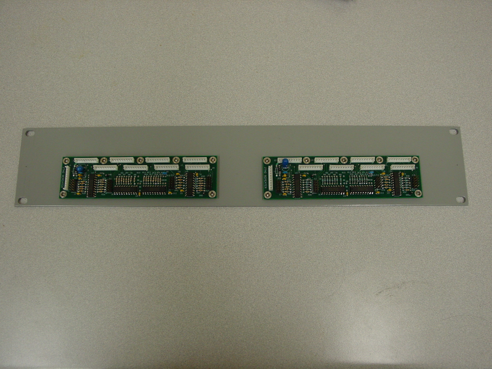
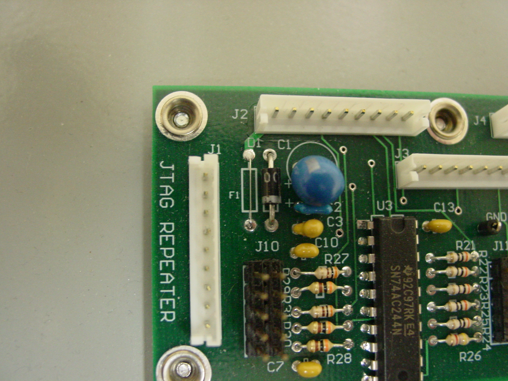
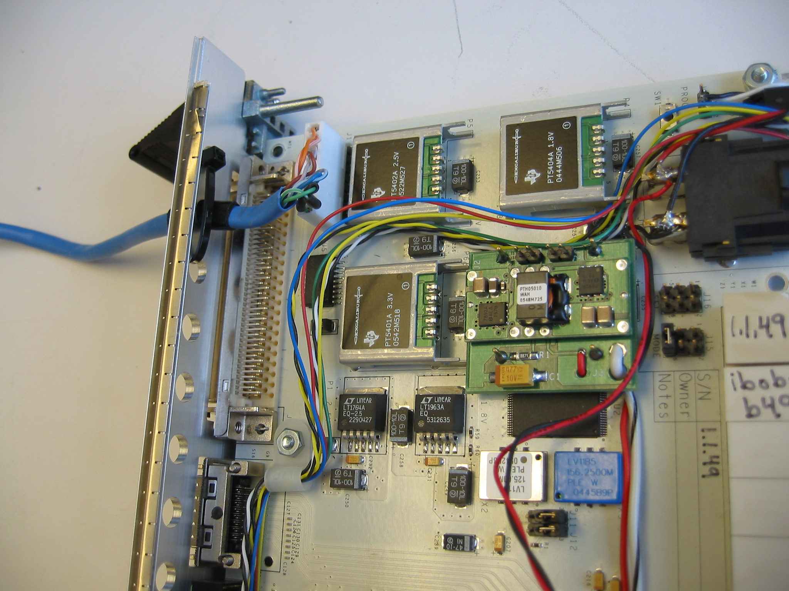

# JTAG Repeater

The goal of this active circuit board is to allow 1 computer to use 1
JTAG programmer, such as the
[Xilinx\_Platform\_Cable\_USB\_II](http://www.xilinx.com/products/boards-and-kits/HW-USB-II-G.htm),
to reliably program, verify and configure 1 to 8 unmodified JTAG devices
like the [iBob](../../FPGA_Hosts/IBOB/README.md). Where the number
of devices, 8, was somewhat arbitrary but does match the number often
installed into 1 standard rack mount chassis. The devices are treated
individually so they may be programmed to be the same design or not as
the application requires.

Programming reliability is improved by a number of techniques:

  - point to point connections, no shared signals, between the JTAG
    Repeater and JTAG devices.
  - source series termination for the signals from the JTAG Repeater to
    the JTAG devices.
  - appropriately valued pullup resistors on open drain signals from the
    JTAG devices.

Please request more information via the CASPER email list.

## Schematics

The PDF version of the schematics may be found [here](schematics/Jtag_repeater.pdf).

The connectors on the JTAG Repeater for the Repeater to JTAG device
links do not have pins with the common 0.1" pitch. Instead polarized
connectors with latches and 2.5mm pitch are used. This has the
unfortunate consequence that new cables need to be made for the Repeater
to device link. Such cables are discussed below.

## Place and Route and Mechanical

Overviews of the place and route files may be found here:

- [JTAG\_place\_and\_route](place_and_route/Jtag_repeater_2011jul28.pdf)
- [JTAG\_mechanical](place_and_route/Jtag_mech.pdf)

There was some discussion of shrinking the board down so that it would
fit onto a 1U, 1.75" tall, rack mount panel. However, the final size of
just over 1U and using very large thru hole components was unchanged to
use up stock of existing parts and for ease of lab debug and hand
reworking.

## Assembly

[Jtag\_Repeater\_BOM.txt](assembly/jtag_repeater_bom.txt)

## Jumpers

[JTAG\_jumpers](documentation/Jumpers_2011may24.pdf)
shows the location of all 2 pin shunts and jumper cable for programming
1 to 8 devices, such as iBobs, via the JTAG Repeater board.

## System Integration

The RAL convention has been to have the left most iBob in the iBob
chassis, when looking from the front, be the first iBob in the chain
connect to JTAG Repeater J2 and then work right and up in J-numbers.
This way upper left most in the impact gui is leftmost physically
installed in the chassis.

## Mechanical Mounting

RAL mounts 2 of the JTAG Repeaters per
[2U\_panel](http://www.alliedelec.com/search/productdetail.aspx?SKU=7365125).
This panel is then mounted near, above or below, the chassis holding the
JTAG devices.

## Debugging

After installation one may find only a partial JTAG chain as in the
impact gui only sees 2 iBobs when you think you've got all 8 connected.
Often times it is best to find the program by starting at the last iBob
and count towards the front the number of devices that are visible. The
ID bits from the missing iBobs are replaced by logic high by the pullups
and the iBobs still in the signal path for the final JTAG data out ==
data into the Xilinx programmer must all be connected thus count back
from the end.

One simple source of failure is when the 1x9 connector at the device, eg
iBob, has become dislodged. Those connectors have no latch of any kind
so it is quite possible for them to be moved when connecting another
cable to a nearby connector such as the RS-232 port.

As of 2011jul27 none of the 5 or so units in the field have ever burned
out the VCC fuse F1. If that were to blow it would prevent the entire
board from functioning and would need to be replaced.

## JTAG Repeater to JTAG device cables

Connector housings and terminals

  - JTAG Repeater end:
      - housing JST Sales America Inc: EHR-9 Digikey 455-1007-ND
      - terminal JST Sales America Inc: SEH-001T-P0.6 Digikey
        455-1042-1-ND

<!-- end list -->

  - JTAG device end:
      - housing Molex: 22-01-3097 Digikey WM2007-ND
      - terminal Molex: 22-01-3097 Digikey WM1114-ND

RAL had a leftover spool of Belden Cat 5E cable and decided to use some
of this to make JTAG cables. This cable is nice in that it fits through
the preexisting iBob faceplate holes and is easy to work with. Lots and
lots of other cables would work as well.

Length: 18 "

This works well for JTAG Repeaters mounted just above or below the iBob
chassis for example. Some testing was done with cables as long as 8ft
but more tweaking is required for viable operation with that length.

Individual
pins:

` twisted pair 1`  
`   pin 1:  Orange      Vref`  
`   pin 2:  white w/ Orange GND`  
  
` twisted pair 2`  
`   pin 3:  white w/ Brown  GND`  
`   pin 4:  Brown       TCLK ---> from JTAG Repeater to JTAG device`  
  
` extra ground (on JTAG Repeater)`  
`   pin 5:          is unused on JTAG devices like the iBob. When used often times twisted w/ pins 6 and 7.`  
  
` twisted pair 3`  
`   pin 6:  Blue        TDO <---- from JTAG device to JTAG Repeater`  
`   pin 7:  white w/ Blue   TDI ----> from JTAG Repeater to JTAG device`  
  
` twisted pair 4`  
`   pin 8:  white w/ Green  GND`  
`   pin 9:  Green       TMS ----> from JTAG Repeater to JTAG device`

## Pictures

.

.

. The
component with reference designator F1 is a simple length of
approximately 30-32 AWG copper wire. The idea is that it will destroy
itself in an over current condition and save the rest of the board.

. The
couple turns of black electrical tape around the CAT-5E cable are to
prevent the sharp edges of the face plate from cutting into the cable
jacket as the cable tie pinches the cable in place. Without the cable
tie it is quite easy for the cable to be dislodged as the iBob is
installed and removed or the JTAG cable is bumped.

## Software

The JTAG Repeater may be used using the Xilinx impact program via the
gui or command line mode. RAL has found only the command line mode
config command to be reliable. The verify and programming commands seem
to work via both the gui and command line. The maximum CCLK setting is a
function of the JTAG Repeater to device cables used. For the 18" cables
described above 6 MHz works reliably. 12 MHz never failed during lab
testing but isn't recommended because of the very small timing margins.

Some users have experienced unix systems getting confused and loosing
its USB connection to the JTAG Repeater as we disconnect and reconnect
it. To revive the connection when run as root these may help :

  - On the RedHat/CentOS systems it is "/sbin/start\_udev".
  - On the Debian/Ubuntu systems it is "/sbin/service udev restart" (or
    something like this)
