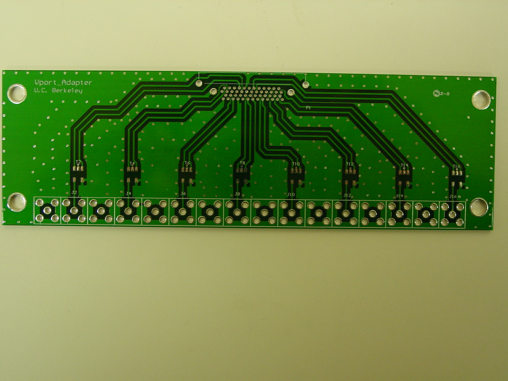
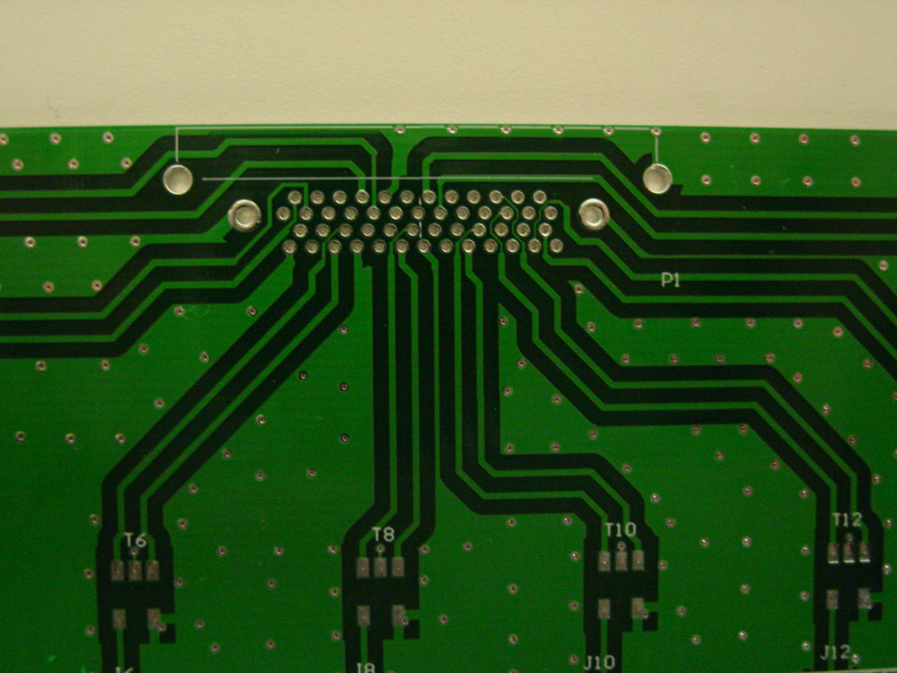
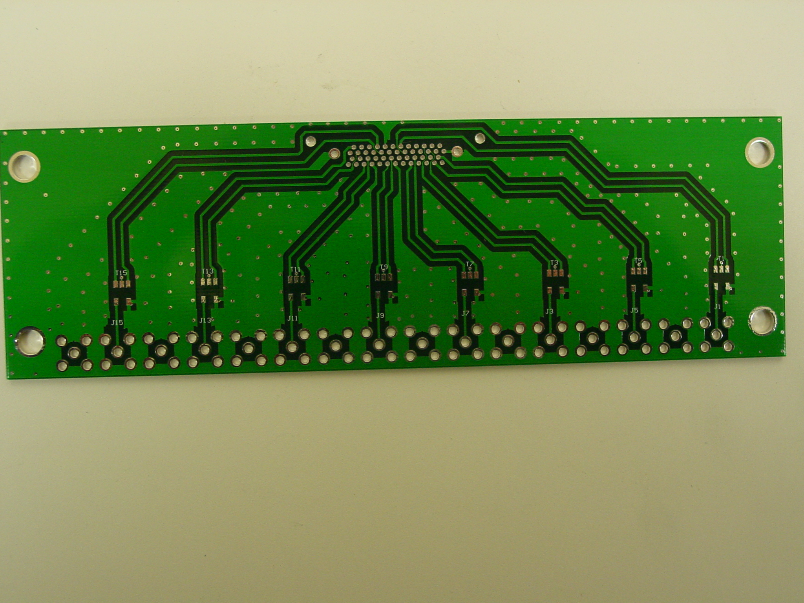
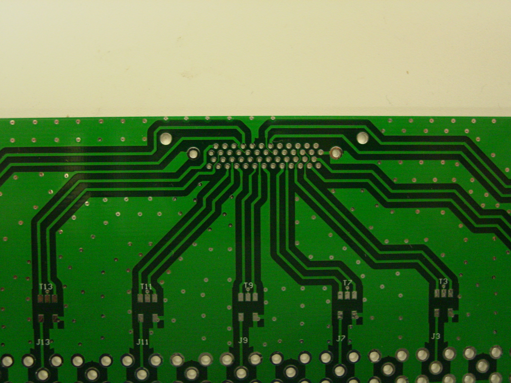

# SMA to Vport adapter

The SMA to Vport adapter board is used, primarily in the lab, to convert
single-ended analog signals into a differential format suitable for the
([ADC16x250-8 differential](../../Mezzanine_Boards/ADCs/ADC16x250-8/ADC16x250-8_differential_rev_2/README.md)) board.

## Block Diagram and pin mappings

  - [block diagram (PDF)](block_diagrams/Block_diagram_2013mar02.pdf)
  - this block diagram is primarily for the ADC16x250-8 differential
    card but it also has Vport connector mapping information.

## SMA to Vport adapter test board

  - 16 right angle SMA socket connectors for single ended test signals.
  - Just as with the clock input to the ADC16x250-8 board, see above, a
    1:2 balun will be used for each of the 16 test inputs. Different
    baluns may be used based on the degree of optimization for operation
    at a particular operating frequency. Or not.
      - [default part: Synergy Microwave TM2-1 1-600 MHz 1:2 input balun (PDF)](datasheets/Synergy_Microwave_TM2-1_balun.pdf)
      - Note the typical output phases are within 3 degrees of 180
        degrees apart from 1 to about 500 MHz.
      - Alternative baluns are compatible with the PCB footprint.
  - All 16 differential pairs output over 1 Samtec 16 way connector.
      - [Samtec](http://www.samtec.com/)
        [1](http://www.samtec.com/ProductInformation/TechnicalSpecifications/Overview.aspx?series=VRDPC)
      - [datasheet (PDF)](datasheets/Samtec_VRDPC.pdf)
      - [cable datasheet (PDF)](datasheets/Samtec_VPSTP.pdf)
        see page 7 for detailed signal and ground pin details.
      - [shielding report (PDF)](datasheets/Samtec_shielding_effectiveness.pdf)
      - [cable characterization report (PDF)](datasheets/Samtec_hsc-report_VPSTP_web.pdf)
  - 8 of the circuits are on the top side of the PCB and 8 are on the
    bottom. This way we can increase the isolation as much as possible.
    And to increase the spacing between the SMA connectors so that
    mating the cables won't be too difficult.
  - SMA center pin to SMA center pin spacing is about 11/16 inch or
    0.6875 inches.
  - The SMA connectors are on the opposite side of the PCB as the
    corresponding etch and balun to minimize the transmission line stub
    at the SMA launch.
  - The board is roughly 6+7/16 inches by 2 inches (by 0.062 inch
    thick).
  - signals are routed as 50 ohm top and bottom layer microstrip with 2
    internal ground reference planes. 4 layers in total.

<!-- end list -->

  - **schematics**
      - [SMA to Vport test board schematics (PDF)](schematics/Vport_adapter_2013jan24.pdf)
      - Page 2 is a combined view of the 2 PCB layers.

## SMA to Vport test board to ADC16x250-8 input mapping

The board was routed so as to maximize the isolation between the
different Vport differential pairs. This leads to a rather strange
mapping of SMA connector to ultimate ADC IC and input number on the
ADC16x250-8 board.

When looking at the SMA face of the board with the top (Vport connector)
side upwards and using the Vport test PCB's silkscreen or schematic
reference designators the connector locations are located
:

| upper or top side SMA connectors    | J1 |    | J5 |    | J3 |    | J7 |    | J9 |     | J11 |     | J13 |     | J15 |     |
| ----------------------------------- | -- | -- | -- | -- | -- | -- | -- | -- | -- | --- | --- | --- | --- | --- | --- | --- |
| lower or bottom side SMA connectors |    | J2 |    | J4 |    | J6 |    | J8 |    | J10 |     | J12 |     | J14 |     | J16 |

Vport adapter test board SMA connector locations

When looking at the SMA face of the board with the top (Vport connector)
side upwards and using the ADC16x250-8 input labels, with ADC ICs A, B,
C and D as U5, U6, U7 and U8 respectively, the SMA connector mapping is
:

| upper or top side SMA connectors    | C4 |    | D1 |    | D4 |    | C1 |    | B1 |    | A2 |    | A4 |    | B4 |    |
| ----------------------------------- | -- | -- | -- | -- | -- | -- | -- | -- | -- | -- | -- | -- | -- | -- | -- | -- |
| lower or bottom side SMA connectors |    | C2 |    | D2 |    | D3 |    | C3 |    | B3 |    | A1 |    | A3 |    | B2 |

ADC16x250-8 inputs on the Vport adapter test board

This table is ordered left to right when looking at the SMA connector
mating faces.

  - ADC ICs A, B, C and D are U5, U6, U7 and U8 respectively
  - Perhaps this will help find a pattern if we see isolation
    measurements differ across the 16 inputs
?

| Vport test board SMA | \+ pin - pin | ADC IC and input number | Vport test PCB balun and etch side | ADC16x250-8 PCB etch and input circuitry side |
| -------------------- | ------------ | ----------------------- | ---------------------------------- | --------------------------------------------- |
| J1                   | 36, 36       | C 4                     | bottom                             | top                                           |
| J2                   | 33, 34       | C 2                     | top                                | top                                           |
| J5                   | 2, 3         | D 1                     | bottom                             | bottom                                        |
| J4                   | 27, 28       | D 2                     | top                                | top                                           |
| J3                   | 30, 31       | D 4                     | bottom                             | top                                           |
| J6                   | 5, 6         | D 3                     | top                                | bottom                                        |
| J7                   | 8, 9         | C 1                     | bottom                             | bottom                                        |
| J8                   | 11, 12       | C 3                     | top                                | bottom                                        |
| J9                   | 14, 15       | B 1                     | bottom                             | bottom                                        |
| J10                  | 17, 18       | B 3                     | top                                | bottom                                        |
| J11                  | 20, 21       | A 1                     | bottom                             | bottom                                        |
| J12                  | 45, 46       | A 2                     | top                                | top                                           |
| J13                  | 48, 49       | A 4                     | bottom                             | top                                           |
| J14                  | 23, 24       | A 3                     | top                                | bottom                                        |
| J15                  | 42, 43       | B 4                     | bottom                             | top                                           |
| J16                  | 39, 40       | B 2                     | top                                | top                                           |
|                      |              |                         |                                    |                                               |

## Design files

  - [Gerber files for fabrication (tar)](gerbers/Vport_adapter_2012aug21.tar)
  - [BOM spreadsheet for assembly (xls)](BOM/Vport_BOM_2012jan07.xls)
      - At the bottom of the BOM file linked to above there are
        suggestions as to which subsets of parts must be and could be
        populated if the Vport adapter is to only be use with just 8 or
        just 4 inputs.

## pictures

`Bare PCB`

Assembled PCB

  - [Vport test board top soldered (JPG)](photos/Vport_test_top_soldered.JPG)
  - [Vport test board SMA face (JPG)](photos/Vport_test_SMA_face.JPG)
  - [Vport test board bottom soldered (JPG)](photos/Vport_test_bot_soldered.JPG)
  - To support S11 measurements two 100 ohm terminating resistors we
    added to the Vport connector pins. This way we could make some
    measurements of the signal path for the test signals before the 1
    meter Vport-Vport cable, and ADC16x250-8 board, are added. The
    terminating resistors are on
      - top side SMA J9 -\> bottom side balun T9 -\> short etch run -\>
        Vports pins 14 and 15
      - bottom side SMA J2 -\> top side balun T2 -\> long etch run -\>
        Vports pins 33 and 34
      - [Vport test board 100 ohm terminating resistors (JPG)](photos/Vport_test_100_ohm_res.JPG)

## Assembled PCB "features"

  - Two non-functioning baluns were found during initial lab testing of
    the first assembled Vport adapter board. Some how the brazed? wires
    are becoming disconnected from the small PCBs to which the ferrite
    and windings are mounted. Too much shaking ? Too much heat during
    soldering ? In any case many tradeoffs are made in the assembly of
    these baluns. Not too surprising they are delicate.
  - the lifted wire is at the lower right hand corner of the T13 balun
    in the picture below. The empty component pad is clearly visible.
    The lifted wire is harder to see but it is running off to the left
    towards the other output pin.
  - repairs are performed by soldering the wire to the correct component
    pad (or replacing the entire balun).
  - [disconnected balun output wire (JPG)](photos/T13_lifted_lead.JPG)

## Vport adapter test board tests

  - The spreadsheet below is a first pass at predicting the losses in
    the analog inputs due to the SMA to Vport adapter and the Samtec
    cable which deliver the inputs to the ADC. The summary is that the
    measurements are something like 1.x dB more lossy than simplistic
    calculations find but the phase difference between the 2 signals at
    the ADC input of any one pair do match the expected values.
  - [adapter and cable loss spreadsheet (pdf)](tests/SMA_Vport_adapter_and_cable_loss.pdf)
  - [network analyzer measurements (PDF)](tests/network_analyzer_2013mar07.pdf)
      - The network analyzer measurements were not all that useful. They
        don't show nearly all the coupling that is shown with wide band
        noise inputs and a correlator as the detector.
      - The network analyzer measurements show, as expected, there is
        inter-channel coupling on the SMA to Vport adapter.
      - The network analyzer measurements show, as expected, there is
        inter-channel coupling, and loss, on the Samtec connector and
        cables.
      - Some of the channel pairs couple much more than others.
      - There is at least some suggestion that switching from the high
        density 16way Samtec connector and cable scheme to 16 individual
        cables will increase the inter-channel isolation.

## Contributors

  - Dan Werthimer
  - Calvin Cheng
  - Matt Dexter

## Inventory as of 2013apr14

**RAL built Vport adapter test boards**

  - S/N 001 CFA LEDA lab. Synergy Microwave TM2-1 balun. passed 1st
    order tests.
  - S/N 002 Evans B2F. Synergy Microwave TM2-1 balun. passed 1st order
    tests. Affixed to a 1U shallow depth rack mount shelf.

**DigiCom built Vport adapter test boards**

  - S/N D001 Evans B2F. Synergy Microwave TM2-1 balun. untested For Dan.
  - S/N D002 Digicom. only 4 of 16 Synergy Microwave TM2-1 baluns.
    Partially tested. For NRAO.
  - S/N D003 Digicom. only 4 of 16 Synergy Microwave TM2-1 baluns. Needs
    Vport connector. untested. For NRAO.

## Schedule

Here's a somewhat randomly selected dates of possible significance.

  - 2012aug10 start to design the SMA to Vport adapter board
  - 2012sep13 learn that Samtec is switching vendors for their Vport
    connectors and cable assemblies; getting parts will be a hassle.
  - 2012sep24 first SMA to Vport adapter board hand assembled at RAL has
    been tested in the lab and has been shipped to the FPGA gateware
    developer in preparation for the next round of tests.
  - 2012oct15 All ADC16x250 and SMA to Vport adapter parts are at
    DigiCom for professional assembly.
